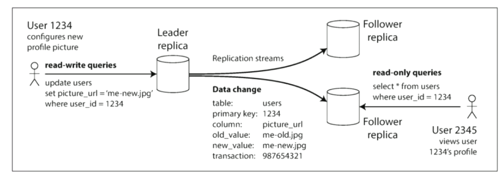

# 分布式学习笔记5：分布式存储（1）

**内容几乎全部来源于  西安电子科技大学 李龙海 老师的分布式系统课程。**

博主只是老师的速记员

## 分布式存储要达成的目标

> 实现分布式存储各项功能的基本手段：复制和分区（切片）

- 提高数据存储容量：让**总体存储容量**随节点增多而增大（水平可扩展）；
- 提高数据吞吐量：让**总体吞吐量**随节点增多而增大（水平可扩展），比如将一个大文件切片存储在多个主机内，要获取该文件时即可同时从多个主机同时进行下载；
- 提高可靠性 / 可用性：部分节点故障时数据不丢失 / 部分节点失效不影响整个系统的数据读写（容错性）；

- （可选）降低数据访问延时：用户可以从地理位置上最接近的节点获取数据（如 CDN，Content Delivery Network，即内容分发网络）；
- 与分布式数据处理系统相配合，提高分布式数据处理系统的运行效率。既然分布式存储可以存储文件，那么也就意味着可以存储代码（可执行文件），这就可以和分布式数据处理系统相配合使用了。“移动程序而不是移动数据，移动计算比移动数据更划算”——若发送处理程序消耗的时间远小于发送待处理文件，那么将程序发送到存储着待处理数据的节点上就非常划算。

#### CDN 例子

CDN 是帮助大型网站分发内容的分布式系统。

新浪会在全国各地部署非常多的 Cache Server ，新浪会在进行数据更新时将数据推送个各地的缓存服务器进行数据缓存。

这里其实要在 DNS 上会搞一个小动作——我们向新浪 sina.com 发送的请求，实际上会被发送到距离我们最近的 Cache Server ，然后从这里来获取内容，以大大提升访问速度。

（这里的“最近”非物理距离，而是访问延迟最低，具体还会和运营商相关）

## 基本手段：复制和分区（切片）

### 复制（Replication）

基本思想：在多个不同节点上保存相同数据的多个副本（Replica）

对数据进行备份，首先能够提供冗余备份——让系统在一些节点失效的情况下仍能正常进行数据服务。其次，多个数据副本的存在也能够提高数据的吞吐速率、改善访问数据的性能。

而数据的多备份也带来了一些问题：

- 多备份带来的占用空间的倍增，直接导致硬件成本的上升；
- 数据变更时会引发多副本一致性的问题。比如服务器发生异常重启之后该如何重新和系统整体的当前状态进行同步。

> ##### 处理失效的 Fail-Stop-Recovery 错误模型
>
> 商业服务器系统中会有一个“软件狗”（有软件方案也有硬件方案），其会不断监控服务器机组是否正常运行（比如定期发送请求，检查服务器是否能够正常响应）。如果服务器出现问题（ Fail ），软件狗就会自动对失效服务器发送 reset 指令进行重启（ Stop ），重启后重新启动并恢复服务（ Recovery ）

### 分区（Partitioning）

基本思想：将一个大的数据文件 / 数据库拆分为较小的子集（这个拆分就叫做分区Partition / 切片Shard），并存储在不同的节点中。分区能够提高吞吐率（并行读写）和可靠性（部分节点失效只会部分丢失，如果文件使用了纠删码存储则可在部分丢失的情况下恢复丢失部分），并可以在和分布式计算结合的场景中，为数据并行处理提供方便（比如后面会提到的 Map-Reduce ）。

但分区也会带来如下问题：

- 跨区查询问题（分布式索引问题）；

  比如我们将一个巨大的 SQL 数据表拆分为了多个子表，不同的子表存在不同的服务器中

- 合理、动态分区问题（大数据如何拆分。不同的分区访问频率不同，某些分区可能突然称为访问量突增的热点）；

- 负载均衡问题（各个分片如何合理分配给不同节点）；

- 分布式事务处理

#### 例：数据库的复制和分区

MySQL 数据库在一个数据表超过百万条记录后，其查询效率就会出现明显的下降。解决该问题的有效方法就是拆表

（拆表需要注意拆表的方法，不良的拆表会引发频繁的跨表查询，降低查询效率）

该方案根据主键范围进行分区，同时进行双副本备份

#### 多副本需要解决的问题

- 数据更新时的一致性问题（后面会讲 Paxos）；
- 负责存储的节点选择问题（如何兼顾性能和可靠性？）
  - HDFS 会将三个备份中的两个放在同一个机架的两个节点中，而第三个副本会放在另一个机架上的节点中，如果有第四个副本就要放到更远的机架上（也可以选择异地）。这种方案可以兼顾效率和可靠性。
  - 可靠性：同一个机架使用同一组电源和交换机，电源或者交换机挂了就一挂挂一架；
  - 效率：同一机架内的服务器使用同一组交换机，在同一机架内的不同服务器互相访问速度最快，而且机架内通信不会影响其他机架通信。
- 访问数据时如何查找副本所在节点的问题（后面讲 HDFS 的时候会讲）。

#### 复制策略：基于领导者的复制（Leader-based Replication）

aka. 主动/被动（Active / Passive）复制、主/从（Master / Slave）复制、主/备（Primary / Backup）复制

基本思想：

- 副本之一被指定为领导者（主库），其他副本则被指定为追随者（从库）；
- 客户端要向数据存储系统写入数据时，必须将请求发送给领导者。领导者会将新的数据写入本地存储，同时将变更发送给追随者；
- 客户端要读取数据时，向领导者 / 追随者查询均可；
- 适合读多写少的场景

示例：三个同步的 MySQL 数据库，只通过主库写入，但能通过三个库读取

#### 复制方法分类

##### 单主复制

- 一个领导者，多个追随者。适合读多写少的场景，但主库是性能瓶颈，又是单点故障节点（Single point of failure）