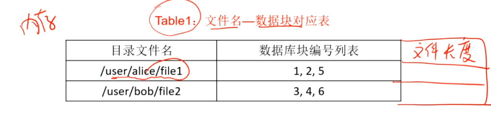

# 分布式学习笔记6：分布式存储（2）HDFS

## 案例：分布式文件系统 HDFS

将分布式系统中多个节点的存储资源整合在一起，向用户 / 应用程序呈现统一的存储空间和文件系统目录树，用户无需关心数据具体存储在哪个节点上。

大文件可以被自动分块并分别存储到不同的节点上。为提高可靠性，分布式文件系统还会进行多副本备份。

HDFS 采用主从构架，有一个主节点，即下面的 NameNode 服务器。

NameNode 服务器需要维护整个 FS 的元数据（文件名、文件长度（即以字节为单位的大小）、文件所有者、创建日期等）、管理其他的数据节点（ DataNode ，存储文件的实体数据 ）、进行多拷贝维护和管理存储的负载均衡

HDFS 中的所有文件都会被拆分为数据块，每个数据块大小的典型值是 128MB （但具体大小可以手动设置）。比如一个 300MB 的数据就会被拆分为三个数据块，分别为 128、128、44MB ，而每个数据块都会有一个全局唯一的编号 。

HDFS 会**在内存中维护两个表**（可以加快查询速度），这两个表在硬盘上的备份会以日志的形式进行（ HDFS 中的日志叫 Journal ）。HDFS 中还有一个专门的 backupNode 专职负责备份，同样会保存日志。

NameNode 对于元数据使用一种叫做 “ Checkpoint ” 的东西进行保存（实际上就是快照，定期进行整体的落盘备份）

#### 文件名-数据块对应表

上面的编号仅作示例，实际上可能是 hash 值、随机数这种全局唯一的值。

每个文件最后一块的大小要通过文件长度值进行计算（前面所有的块大小都是相等且已知的）

#### 数据块-物理节点对应表

以双备份策略为例，每个数据块都会在两个节点上存储两个副本

在实际的 HDFS 应用中，对文件的读请求要通过一个 Proxy 进行。过程如下：

1. 为 Proxy 提供读取指令及参数后（如：/user/bob/file2  offset=0  length=10），Proxy 会将读请求发送给 NameNode；
2. NameNode 通过查表确定该文件所在的数据块以及数据块对应的一组 DataNode 的 ip地址（上面的例子中，就是DN1、DN3 ），并将该位置返回给 Proxy；
3. 客户端根据某种规则来选择读取数据的节点（比如选一个延迟最小的），直接连接到该节点进行实际的数据读取。

客户端在从 NameNode 获取到元数据之后，可以将这些信息缓存下来。而且实际的数据传输都是 DataNode 和客户端直接进行的，与 NameNode 只会进行简单的交互，因此并不会对 NameNode 产生较大的压力

## HDFS 相关问题

该部分内容来自互联网

#### 客户端读取 HDFS 系统中指定文件偏移量处的数据时的工作流程？

1. 客户端调用 FileSystem.open() 打开要读取的文件；
2. DistributedFileSystem 进行 RPC 调用 namenode，确定文件起始块位置；
3. Client 对输入流调用 read()；
4. 存储文件起始块的 datanode 地址的 DFSInputStream 连接到距离最近的 datanode，对数据流反复调用 read()，可将数据从datanode 传输到 client；
5. 到达块末端时， DFSInputStream 关闭与该 datanode 的连接，寻找下一个最佳 datanode；
6. Client 读取数据时按照 DFSInputStream 与 datanode 新建连接的顺序进行读取，需要询问 namenode 来检索下一批需要的 datanode 的位置。读取完成后调用 FSDataInputStream .close()

#### 客户端向 HDFS 系统中指定文件追加写入数据的工作流程？

1. 打开已有的 HDFS 文件

   客户端调用 DistributedFileSystem.append() ，该函数会先调用 ClientProtocol.append() 获取文件最后一个数据块的位置信息，若文件最后一个数据块已写满则返回 null ，然后 append() 函数调用 DFSOutputStream.newStreamForAppend() 创建到这个数据块的 DFSOutputStream 输出流对象，获取文件租约，并将构造的 DFSOutputStream 函数包装为 HdfsDataOutputStream 对象并返回。

2. 建立数据流管道

   DFSOutputStream 的构造器会判断文件最后一个数据块是否已写满，若没有，则根据 ClientProtocol.append()  方法返回的该数据块的位置信息建立到该数据块的数据流管道。如果写满了则调用 ClientProtocol.addBlock() 向 namenode 申请一个新的空块后再建立数据流管道。

3. 通过数据流管道写入数据

   客户端通过该管道写入数据，与直接写 HDFS 文件类似。

4. 关闭输入流并提交文件

   客户端完成追加写操作后，调用 close() 关闭输出流，并调用 ClientProtocol.complete() 通知 namenode 提交这个文件中的所有数据块。

#### 新增数据块时，HDFS 如何选择存储该数据块的物理节点？

在大多数情况下，副本系数是3，HDFS的存放策略是将一个副本存放在本地机架的节点上，一个副本放在同一机架的另一个节点上，最后一个副本放在不同机架的节点上。这种策略减少了机架间的数据传输，这就提高了写操作的效率

#### HDFS 采用了哪些措施应对数据块损坏或丢失的问题？

HDFS 提供了数据完整性校验机制来保证数据的完整性。

当客户端创建 HDFS 文件时，它会计算文件的每个块的校验和 ，并将校验和存储在同一 HDFS 命名空间下的单独的隐藏文件中。

当客户端检索文件内容时，会验证从每个 DataNode 接收的数据是否与存储在关联校验和文件中的校验和匹配。匹配失败则数据已经损坏，此时客户端会选择从其他 DataNode 获取该块的其他可用副本。

#### HDFS 应对主节点失效问题的措施？

DataNode 会通过心跳和 NameNode 保持通信，若 DataNode 超时未发送心跳， NameNode 就会认为这个 DataNode 已经失效，并立即查找这个 DataNode上存储的数据块有哪些，以及这些数据块还存储在哪些服务器上，随后通知这些服务器再复制一份数据块到其他服务器上，保证HDFS存储的数据块备份数符合用户设置的数目，即使再出现服务器宕机，也不会丢失数据。

#### NodeName 维护的“数据块-物理节点对应表”是否需要在硬盘中备份？为什么？

不需要。

因 Editlog 和 FsImage 保存在了本地的文件系统中，Namenode 启动时，它从硬盘中读取这两个文件，将所有 Editlog 中的事务作用在内存中的 FsImage 上，并将这个新版本的 FsImage 从内存中保存到本地磁盘上，然后删除旧的 Editlog ，因为这个旧的 Editlog 的事务都已经作用在FsImage上了。这个过程称为一个检查点(checkpoint)。在当前实现中， 检查点只发生在 Namenode 启动时。 但是 Namenode 可以配置成支持维护多个 FsImage 和 Editlog的副本。任何对 FsImage 或者 Editlog 的修改，都将同步到它们的副本上。