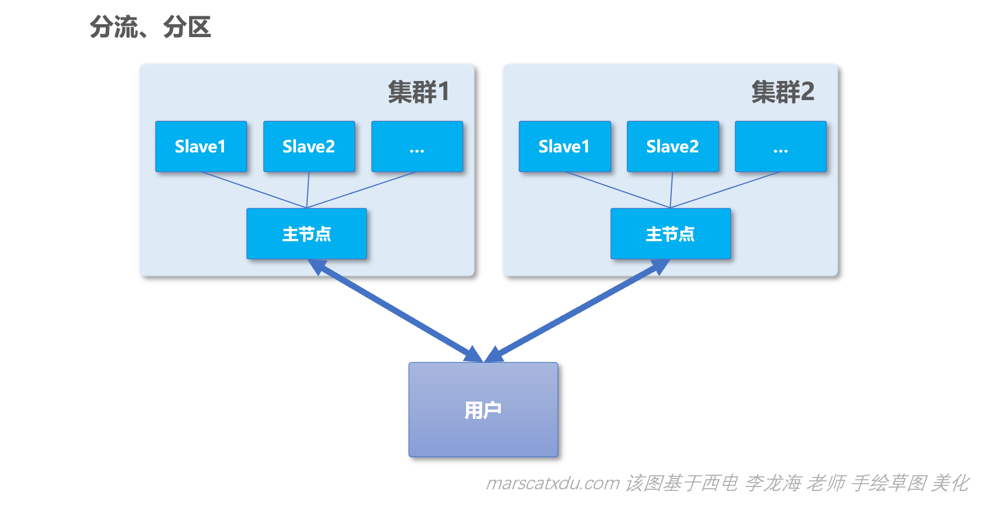
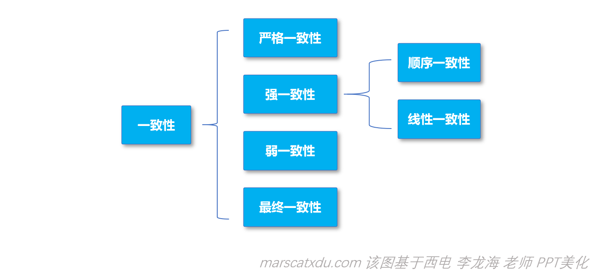
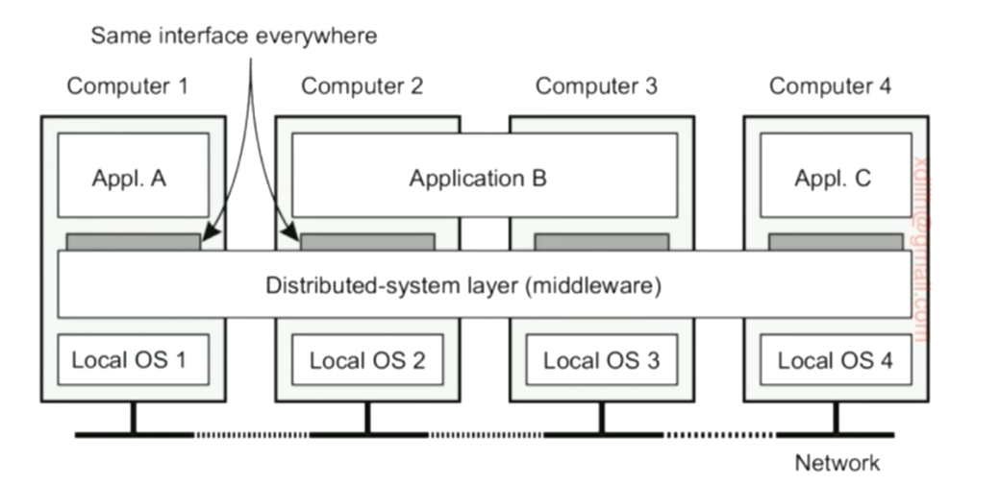

# 分布式系统学习笔记1：概述

**内容几乎全部来源于  西安电子科技大学 李龙海 老师的分布式系统课程。**

博主只是老师的速记员。

本课程是面向普通本科生的课程，内容非常简略、浅显，适合作为“导论的导论”来阅读。

## 分布式系统面临的挑战：

- 异构性：每个节点软硬件都会有比较大的差别；
- 自治：每个节点都有自己独立的时钟和独立的内部状态；
- 局部视图：每个节点只能看到整个系统的某个局部视图，无法以“上帝视角”进行动作；
- 可扩展：随着节点数量的增长，各项性能都可以随之扩展；
- 故障处理：节点本身可能有故障，网络更可能会有故障。发了个包，丢了或者延迟了，这种情况该怎么处理，如何让整个系统容忍局部失效

这里举个例子，以数据库备份为例。

在大型的数据库系统中，常常使用**【一主多备】**的模式来进行数据备份。会有一个主节点和多个备份节点。**只有主节点接受写入请求，主节点再向备份节点发送更新命令。**

该方案优点如下：

1. 可靠性高。就算主节点机房炸了也没事，备份节点中还有数据备份；

2. 能够提高（读取）性能。在这种方案下，读取数据的操作其实可以在任意一个节点进行。毕竟现实中的读取需求远多于写入需求（这种需求的满足，需要以各个节点状态一致为前提，而这个前提的满足并没有那么容易）

   为啥不容易满足呢？我们举两个例子

   1. 在有一个主节点、两个备份节点的情况下，主节点进行一次数据更新后，刚给第一个备份节点发了更新消息，还没来得及给第二第三个节点发，自己就炸了。。那1、2、3的状态就不一致了
   2. 主节点给大家都发了更新消息，但中间包都消失了。。

这种问题，就是**分布式一致性**问题，可以通过分布式一致性协议来解决

### 分布式一致性协议：

#### Paxos

Paxos 应用极广，对每个人都有巨大的影响。很多强大的分布式系统都可以基于该协议实现，比如：

- 腾讯的分布式内存数据库 PaxosStore（已开源，github.com/Tencent/paxosstore）：该数据库把数据暂存在内存中，虽然丢失的风险更大，但是可以通过“多主多备”模式（氪金）来降低翻车的概率。
- 阿里  OceanBase。未开源。数据多副本，通过 Paxos 实现同步。

#### Raft

Raft 因 Paxos 协议过于难懂而被开发出来，对程序员更加友好、易于理解，效率并不比 Paxos 更高；

使用该协议实现的系统有 阿里巴巴的 PolarFS、浪潮内部的分布式数据库等

#### 为什么在一主多备模式下，只有主节点接受写入请求？~~在？凭什么歧视备份节点？~~

在任意一个节点都可以写入的情况下，分布式一致性协议的设计难度要大得多。虽然 Paxos 能够实现这种需求，但会产生大量的消息交互，造成各种意义上的浪费。

一主多备模式下，主节点是整个系统的最薄弱的环节。如果主节点失效，可以自动采取一个备份节点作为新的主节点。

主节点是性能的瓶颈，如果写入请求太多，主节点就顶不住了。可以采用【分区】或【切片】策略来解决问题。说白了就是分流，多搞几个小集群。

如上图中，将用户的写请求进行分流，把一大堆用户的一大堆请求分到不同的集群进行处理，让多个集群分担负载。

## 一致性的分类

良好的分布式系统，从用户的角度观察应该是一个整体（最好就像一个单机系统一样）：比如两个用户同时访问一个系统，A 写入某个值后，B 若进行访问则马上就能读出这个值。这个看似简单的需求，在并发情况下就会变得复杂：

比如用户 A、B 都进行多个请求，每个人的请求都是原子操作（并发的请求必须在逻辑上串行化）。这种情况下，分布式系统处理这两人的一堆请求的顺序就是个问题。

当然可以基于物理时钟把这些请求按照时间顺序严格排序，这样能够实现的一致性叫做**严格一致性**，但这很难实现。

如果分布式系统能够把各个操作按照某种规则来排序，且每个节点看到的用户操作顺序都是一致的，就叫做**强一致性**，实现强一致性的数据库，在用户看来和单机数据库在行为上是一致的（比如先写后读，读出来的一定是刚才写的值）

严格、强一致性的实现要以效率为代价，在一些场景下只需要实现【弱一致性】即可，比如有一个指令是在A节点写“A=3”，在此操作进行后的极短时间内另一用户访问了节点 B ，读出来的值还是 A 节点的 A=3 这个数据更新同步过来之前的值（比如 2 之类的）。在强一致性情况下是不会发生这种情况的。强一致性情况下， 写入 A=3 但两个节点还没进行同步的情况下，如果强行读 A，系统就会告诉我们“暂时阻塞”——即，要么告诉我们不可读，要么告诉我们正确的值，而不会给我们一个失效的值。

- 不同的场景下，采用的方案是不一样的。比如金融行业就一定要强一致性，而微博就可以只实现弱一致性。
- 若我们可以证明，只有在 T → ∞ 的时候才能实现一致性，那这实现的就叫【最终一致性】，比如比特币、区块链这类应用。

## 一些分布式系统的实例

### 协同文档编辑

要实现的效果类似腾讯文档：支持多个用户同时编辑同一个文档。我们在这里脑补的设计中要求该文档在每个分布式节点上都有一个本地备份。

以 Word 文档举例。

我们想要做的事情是这样的：在文档已经存在之后、所有人在修改文档之前，所有节点的文档初状态都是一致的（比如都为空）。之后随着各个节点对文档的修改，每个节点都将自己对于文档的修改广播到其他所有节点。每个节点收到其他节点的修改之后，对本地文档进行修改（更新内部状态），最终达到一致。

在该例中，每个节点都相当于是主节点，相对于该节点的其他所有节点都相当于备份节点。

有一个可用于解决该类问题的协议，叫做**【顺序一致性广播】**

- 每个节点对于本地文档的操作，都要广播给其他所有的节点。我们用这个广播，需要做到保证各个节点接收到各项操作的顺序完全一致。
- 在传输过程中，消息的延迟是不可控的。在物理上，每个节点接收到消息的顺序都不会是一致的，所以我们需要一种办法，来保证所有消息的顺序都是一致的，这就是【顺序一致性广播】

### 设计实例：资源共享分布式系统（分布式存储）

#### Web 系统

- web 系统是个大型网页数据库
- 其为“网状结构数据库”，网页的超级链接之间，就构成了一个网状结构的数据库而非关系型数据库。

#### 域名系统

- DNS 系统，其为一个树形结构。整个域名对于我们用户而言，是一个树形的数据库。

#### 网络文件系统 NFS、HDFS

- 比如我们有多个主机，每个主机都有自己的硬盘。这些主机协同起来，对外表现为一个统一的文件系统（在用户看来是一个目录树）。在该分布式文件系统中，用户看到的就是和本地文件系统一样的，一棵抽象的目录树。用户无需关心文件具体和哪个主机对应，所有主机加在一起就是一个大硬盘，有一个统一的目录树。

### 高性能计算系统

所有的高性能计算系统都有一个共同的特性：

底层由很多的计算节点（即，计算机）组成，而在应用层看来，下面这些计算节点统一表现为一个统一的资源池。一个被部署到该系统上的程序会被自动分发到各个节点上进行运行。每个节点都不会完整执行程序，而只会各自执行部分程序——具体执行哪部分，由分布式计算平台自动进行分发。

常用于大数据处理。

Map-Reduce（编程模型）、Spark、TensorFlow

## 分布式系统垂直构架

分布式系统的应用承载方式，和传统的方式不大一样。

大致如下图，分布式系统将所有的硬件连通，抽象为一个整体，对应用提供统一的服务，应用可以在这个抽象的整体之上弹性伸缩，以不同的方式来运行。

上图中的每个节点都有自己的 OS，但所有节点中间多了个【分布式中间件】，分布式系统的底层算法都靠中间件来实现。

- 比如，若 A 想给其他节点进行一个原子广播（要么所有节点都收到，要么就都收不到，不允许出现有人收到有人没收到的情况）实现原子广播也是很复杂的，这个就要靠中间件来实现。
- 比如，分布式系统往往支持节点的动态加入和退出，这些也要靠中间件来管理。

在网络时代，我们的应用往往都是“面对中间件”，而非直接建立在 OS 之上的。