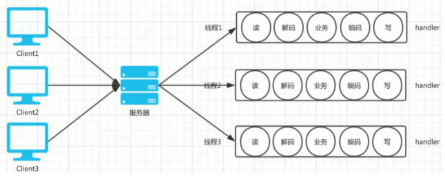
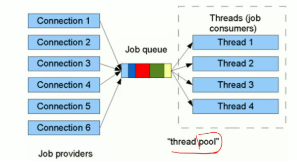
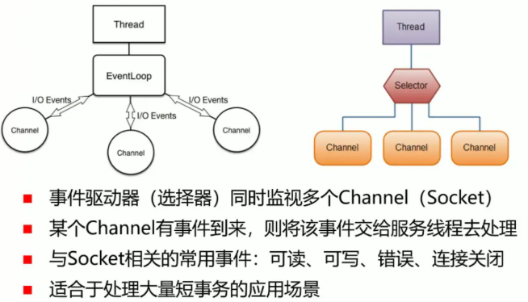
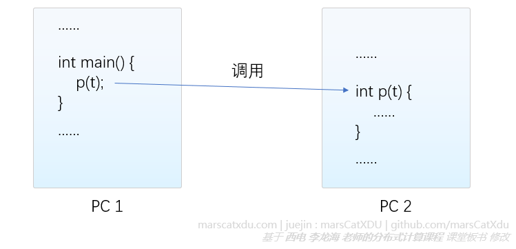
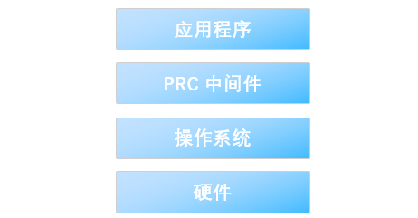
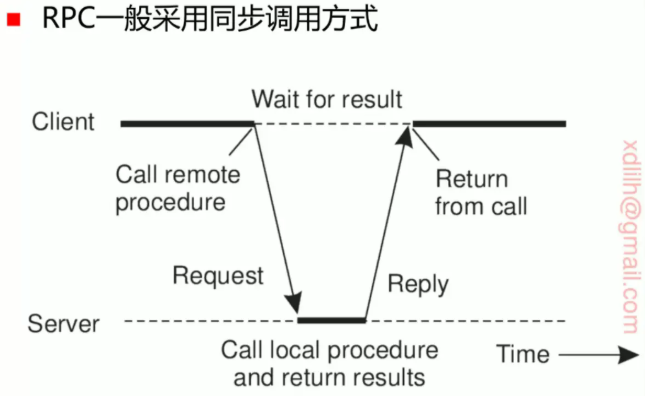
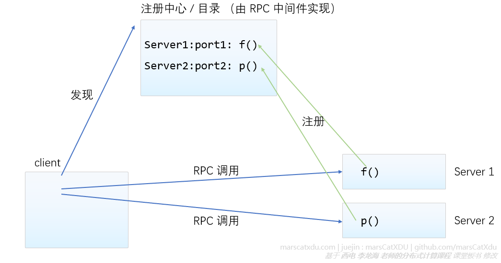
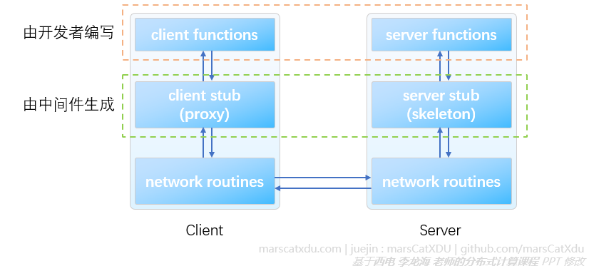

# 分布式系统学习笔记2：分布式节点之间的通信技术：并发服务技术、RPC 概述

**内容几乎全部来源于  西安电子科技大学 李龙海 老师的分布式系统课程。**

博主只是老师的速记员。

本课程是面向普通本科生的课程，内容非常简略、浅显，适合作为“导论的导论”来阅读。

-----

点对点之间的最基本、最底层的通信方式是直接基于 TCP / UDP 建立 Socket 连接，这相当于在两机器间建立一个字节流管道

## 并发服务技术

并发服务是指服务端同时对多个客户端的请求进行服务。以下是几种常见的实现方法

### 基于多线程的并发服务

服务器每收到一个请求，就创建一个服务于该请求的线程来进行服务，有多个请求就创建多个线程。

该方案的优点是逻辑简单，每个线程内部的逻辑完全相同

每个线程内部逻辑完全相同，比较简单。但缺点也非常明显：对于线程的频繁创建和销毁会造成较大的开销，且线程过多时会产生很高的线程切换成本

### 基于线程池的并发服务

该方案建立了一个能够暂存客户端请求的请求队列，并建立了保留多个线程的线程池。在没有收到请求时，线程池中的线程处于休眠状态，接收到请求时则会被唤醒并进行服务。该方法相较于上一个直接创建线程的方案能有效提升性能

该方案能够避免进程创建与销毁的开销，并能防止建立线程过多造成拥塞：线程池可以根据预先的设定**在一定范围内**增加线程的数量。

当同时存在的线程达到线程数上限后，新请求会被放入队列，等待线程池中有空闲线程之后再进行服务。

但由于队列大小总归是有限的，请求过多时队列也会装不下。这时可以增加服务器数量，用多个服务器来并发地处理客户端的请求。

但无论是多线程并发服务还是线程池，终究还是存在切换问题，切换过多总会造成较大的开销、浪费性能。

### 事件驱动技术（多路复用技术）

事件驱动技术的核心思想，是把客户端的请求分成一个个小事件，然后在少数的线程中串行解决这些小事件。

该方法适用于对请求的处理和响应可分解的业务场景，以订单查询为例：当用户发起一个订单查询请求时，负责接受订单查询任务的服务器直接把读库的操作发到数据库，然后再等待接收其他客户的订单查询请求。待数据库返回结果后，再回过头来服务第一个请求，把需要的数据返回。

## 远程过程调用 RPC

RPC 可以隐藏调用细节，让我们调用服务端子程序的感觉就像调用本地子程序一样。而被调用者也无法分辨该调用来自本地还是远程。

RPC 强化了【面向接口编程】的编程风格，让多模块的并行开发变得更加简单和清晰：各个模块（比如前端、后端）的开发组在定义好接口后，即可基于约定好的接口进行并行开发。对一个开发组而言，另一组的工作全部被抽象为一套约定好的接口，两个模块的耦合就仅限于这一套接口。只要不修改接口，两个模块内部的修改均不会对其他模块造成影响。

想要实现 RPC 必须有 RPC 中间件的支持，中间件处理好了底层通信细节，为我们的应用程序提供 RPC 服务。

基于中间件可以简单地实现跨进程、跨语言、跨网络、跨平台的调用，比如 Google 出品的 gRPC 几乎可以实现所有主流编程语言互相调用。（中间件也是基于 Socket API 实现 RPC）

#### 同步调用和异步调用

同步调用：会在下个过程进行的时候阻塞等待，返回后才会继续执行。

异步调用：发起调用后会继续执行，中间不进行等待。在一个时间段中两边并行。远程执行完毕时发来通知

## **远程方法调用** RMI

RMI 让我们可以像访问本机对象一样来访问远程主机中的对象（访问对象、调用方法），还支持直接用对象作为参数进行调用。

RMI 同样需要 RMI 中间件的支持。RMI 中间件一般支持整个系统范围内的垃圾回收

> 垃圾回收：系统会不断扫描整个系统中各个主机是否有任何代码在引用某个对象，如果都没有，就销毁该对象并回收资源

### RMI 中间件需要实现的东西

- 实现使用 Socket 进行调用者与被调用者之间的通信协议（RPC协议）；

  > 通信协议需要包含包格式的设计、交互模式（一问一答，或多问多答等），需要解决一些怎样通过调用信息（要调用的方法、参数等）来决定具体调谁、怎么返回的问题

- 实现过程参数的序列化、反序列化；运算结果的序列化、反序列化（序列化可以将一段内存转化为字节流，以便通过 Socket 进行收发）

  序列化与反序列化：把存有一个对象的一段内存转化为一个字节序列的过程叫做序列化；将字节序列恢复成内存对象叫做反序列化。

  由于以下这些问题的存在，使 RMI 中对象的传输的实现不能直接通过读内存并把数据编码、接收解码平铺到内存里的方法来实现：

  1. 编码问题：如果直接用dump，可能会由于异构导致【大端小端】问题、编码方式问题等；

     > （dump：一般指将数据导出、转存成文件或静态形式。比如可以理解成：把内存某一时刻的内容，dump（转存，导出，保存）成文件）

  2. 元数据传递问题：两边的软件使用不同语言编写（比如 C++、Java），这两种语言的对象之间是不兼容的。

     > （元数据：描述包含对象的那一段内存中该怎么分段、哪一段代表什么）

  3. 对象引用问题：比如对象里面有个指针成员，该指针指向了另一个对象。这种【嵌套对象】的情况如何整个实现序列化。

- 通信过程中的错误处理

- 过程服务过程（或远程对象）的集中注册与发现（目录服务）

  - 为避免客户端和服务端的紧耦合关系（比如客户端必须提前知道服务端的地址和接受调用的端口号才能进行调用，这样就把一个服务端和客户端捆住了），rpc 通过注册中心，将不同的服务器想要暴露出来、供外界调用的方法进行注册，记录服务器端点和该服务器暴露的方法的对应关系。
  - client 可以在注册中心发现有哪些方法在哪些服务器上，再根据这个信息直接点对点进行 rpc call。（注册中心由 rpc 中间件实现）
  
    

## RPC 与 RMI 原理简述

RPC 中间件会在我们的 client 进程中生成叫做 proxy （代理）或者 client stub （存根）的模块。在 server 端生成一个 skeleton。

中间件生成的这两个模块会嵌入到两边的进程空间中。

若服务端生成了一个 f 函数，proxy 就也会生成一个 f。客户端在调用 f 的时候实际上调用的是 proxy 中的 f，而这个 f 并不实现具体逻辑，其只作为“代理”—— proxy 在这里会建立一个连接到服务端的 skeleton 模块 的 socket ，将参数序列化后传输给 skeleton。skeleton 再在 server 内部扮演调用者来调用 f ，f 返回值返回给 skeleton 之后再由 skeleton 通过 socket 发送给调用者，一直返回到 client 中的调用者。

- 客户端的 stub 并不是预先生成好的，其根据服务端暴露的接口动态生成。它要暴露和两端一模一样的接口，两端命名相同。

- JDK 1.5 以后，由于 java 的反射机制日益牛逼，RMI 做到了可以在运行时动态生成客户端 proxy 和服务器的 skeleton

