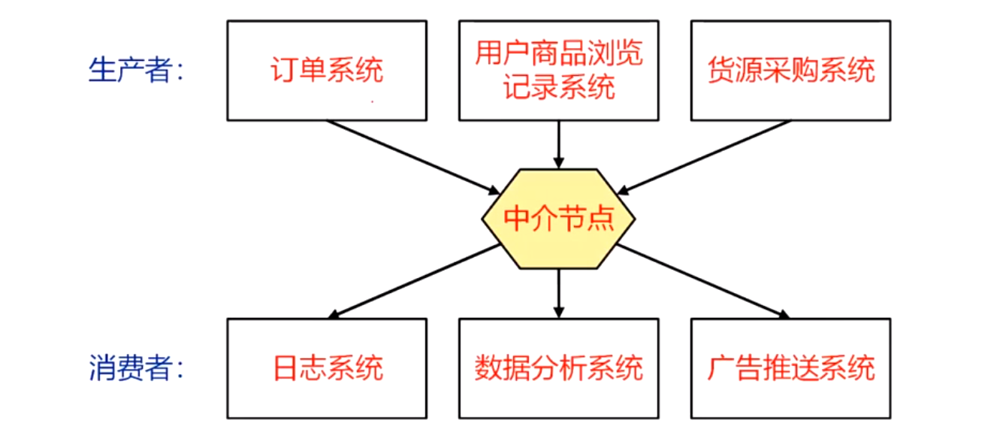
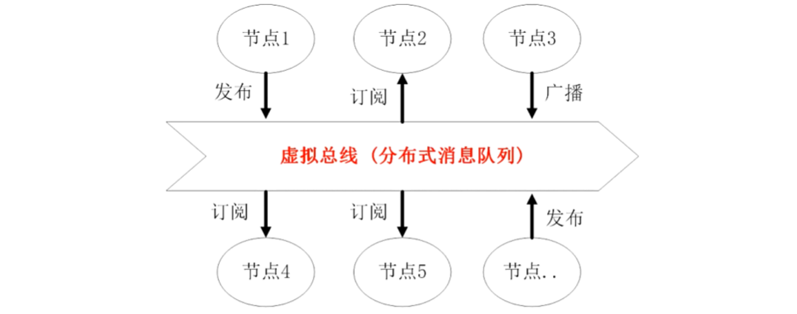
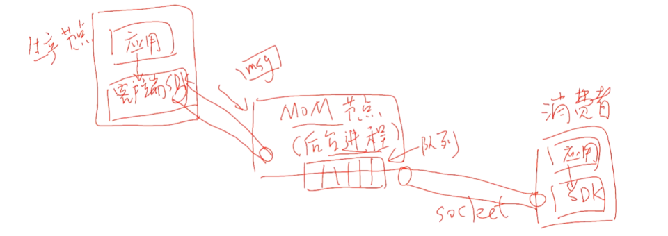
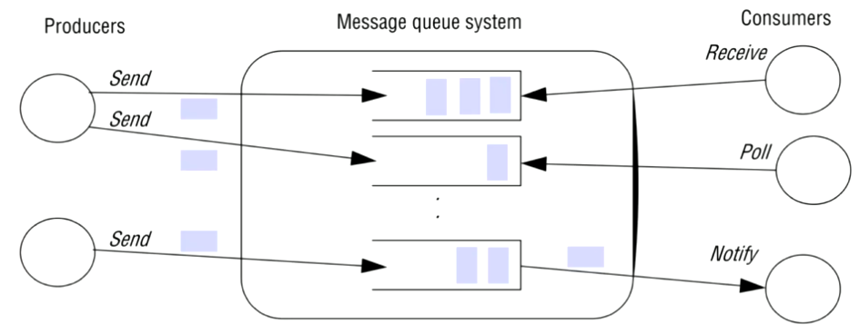
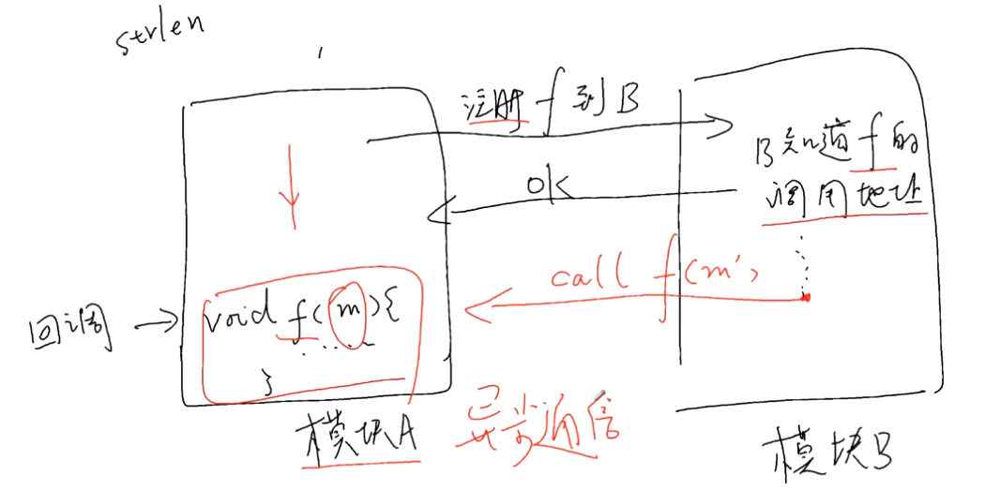
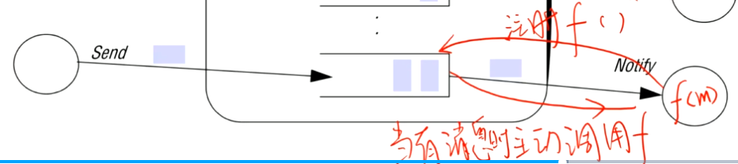

# 分布式系统学习笔记3：接口定义语言 IDL 简述、WebService 简述、消息中间件

**内容几乎全部来源于  西安电子科技大学 李龙海   老师的分布式系统课程。**

我只是老师的速记员

## 接口定义语言IDL（Interface Defination Language）

### CORBA IDL

- 在跨语言环境下，接口的定义开始变得复杂——我们该怎么定义接口长成什么样子呢？我们使用 IDL 来定义支持数种语言的 RPC 接口定义

- 上面是十几年前流行的重量级 RPC 中间件 CORBA 的 IDL

- CORBA 还提供了两个工具：idl2Java 和 idl2CPP，能分别将 .idl 生成为 .java 和 .h，然后两伙人就可以把这俩东西拿走去在上面搞了。这俩玩意都只包含接口的定义（有实现就见鬼了2333333）。 

  

  两伙人的工作流程如上图。协作的交集就只在接口定义部分。

  - proxy 模块的生成需要依据接口定义进行。比如 rmic 工具可以把 xxx.java 生成为 xxx_proxy.java。
  - 支持动态代理技术的语言，就不需要执行这个 proxy 模块生成的工作了（实际上是在语言内部悄咪咪就给干了，只不过不用我们亲自来搞）

### Google Protocol Buffers

Google Protocol Buffers 是一种对象序列化标准和开发库，gRPC 的序列化用的就这玩意。

其可用于网络包格式，甚至可以用于定义文件格式。比如，我们可以用它来定义一个不同语言都可以读写的配置文件（大家把这玩意简称为pb格式，类似于xml、json这些东西，但占用空间远小于xml、json）

## WebService

### WebService 的特色

- WebService 是为了方便网络上不同节点之间互相操作（实现 RPC ）而定义的一套协议标准

- WebService 使用 HTTP 作为传输层协议实现 RPC，原因如下：

- - 解决防火墙问题。绝大多数防火墙都会放行 HTTP；
  - 基础设施丰富，要啥有啥。浏览器多的是，后端 HTTP 服务器软件比如什么 tomcat、IIS、Apache、Nginx 也丰富的很；

- 其主要用于跨企业（B2B）大型业务调用，这种调用不会特别重视效率；

- 使用 C/S 模式

- 支持跨平台、跨语言，面向接口

- 实现面向服务构架（SOA）的重要技术之一：构造一个大型软件时，我们我们使用多个企业提供的服务组合成新的服务（现在就比如各家的 API、SDK）。

WebService 和 我们熟知的自建服务 api 主要区别如下：

1. WebService 直接走80端口的HTTP协议
2. api 是 C/S，WebService 是 B/S（Browser / Server）

### WebService 包含的标准协议：

- 消息编码：xml

- 传输：HTTP、SMTP、TCP、UDP

- 远程对象访问（即，远程方法调用协议）：SOAP（Simple Object     Access Protocol），规定了所有远程调用该操心的玩意

- Web 服务描述语言 WSDL（Web Service     Description Language），和上面的 IDL 是一回事

- 服务目录、服务注册、服务发现 UDDI（Universal     Discovery Description and Integration），定义了注册中心具体实现需要实现的统一的标准接口

- 安全标准：签名、加密、认证等

  

- 服务注册器，其实就是服务注册中心，其往外暴露的就是 UDDI

- Web 服务提供者对外提供的服务，使用 WSDL 对服务进行准确的描述。描述后就要用 UDDI 将 WSDL 注册到服务注册器，这个过程叫做发布/注册

- 服务请求者要发现具体的服务也要通过 UDDI 进行，确定接口的具体定义以进行调用（不过     WebService 行话/黑话 把“调用”叫做“绑定”）

- WSDL 使用 xml 语法

## 消息中间件

### 仅支持点对点通信的缺点

对于复杂的分布式系统，各个节点之间都通过点对点方式进行通信会大大提高系统的复杂度和耦合度。而且由于各个节点之间的通信直接使用 Socket 一对一进行（如果节点和节点之间的通信直接用代码写死），使得扩展性非常差——每次增加新的节点都需要对系统中的多个节点产生影响。同样的，紧密耦合也导致了较差的容错性。

该问题可以通过引入中介节点来解决。

### 引入中介节点

中介节点可以作为一个类似缓冲区的角色加入到系统中，将数据的生产者和消费者分开。该方案的特点和优点如下：

- 降低耦合：生产者会将数据发送到中介节点，消费者会通过某种方式从中介节点获取到所需要的数据（比如通过【主题订阅】模式，“订阅”自己感兴趣的内容）；
- 提高容错性：中介节点可以缓存数据，在部分节点失效 / 速度（短时间内）不匹配时也可以保证数据不会直接丢失；
- 提高可扩展性：生产节点无需关心消费者的情况，消费者也同样无需关心生产者的情况。因此，生产、消费者的增减（类型增减、同类型节点数量增减）均不会对生产者造成影响（如果不需要改变数据结构的话）；

为避免中介节点称为系统的瓶颈，其实际上也可以是一个集群（可以保持逻辑上的单点。这玩意叫【消息队列中间件】，如后面会提到的 Active MQ）

### 面向消息中间件（Message Or iented Middleware，MOM）

该中间件提供了一种分布式消息队列服务，让节点之间可以通过这个中介使用消息进行灵活的**异步通信**。

异步通信：发送方把数据往队列里一放，就可以认为发送成功而去做下一件事情了——而无需阻塞等待接收方收到信息。接收方也是想收数据就收数据，而不用阻塞等待发来的数据

#### 分布式系统的总线构架

该构架中，各个节点通过（虚拟）总线相连。和主机内部的系统总线类似，要发送消息的节点只需要将数据往总线上“一放”就星了（这里，总线的角色由消息队列来扮演），双方完全不必知晓对方的存在（因为时通过订阅来确定谁需要哪些消息）。

这样的一个 MOM 除了自己的进程，还应提供一个给使用其的客户端的 sdk。客户端通过 sdk 提供的接口与中间件连接（一般会建一个socket）。

中间件连接完成之后，应用对于消息的发送和获取都通过 sdk 进行。比如消费者只需要通过 sdk 提供的接口配置订阅的主题，sdk 即会完成剩余的消息获取工作，并在需要时将获取到的消息返回给应用。

### MOM的两种通信模式

#### 消息队列模式

该模式如上面那张图所示，中间件会在生产者、消费者（两者均可有多个）中间建立一个先进先出的队列，每个消息被某一个消费者取走，即会被在队列中删除（这意味着每条消息只能有一个消费者接收到）。这种模式可以实现**负载均衡**。

因为同一个队列会面对多个请求数据的消费者，因此需要中间件按照某种策略来决定将消息发给谁（一般随机选，或者轮询）。

> ##### 负载均衡
>
> 将大量的任务均衡地分配给多个运行同样业务逻辑的服务器。在性能不足时，可以通过简单地增加服务器数量的方式来提升整体性能。

高级的队列模式：带有优先级的队列（优先级高的多给些消息）、支持持久性的队列（中间件会在磁盘上保留备份，中间件掉电之后能够直接恢复）

#### 主题 / 订阅通信模式

这种模式下，可以有不同种类、生产不同类型数据的生产者，生产者可以选择向特定的消息主题发布消息。多个订阅同一主题的消费者可以同时接收到发布该消息主题的消息，因此该模式可以灵活地实现广播、组播的多对多通信模式。

这种模式适用于数个数据消费者都运行各自的业务逻辑的情况——也就是说，同样的一条数据或许会被多个消费者拿去用作不同用途。比如在购物网站中，一个用户产生了一条新的订单数据，该订单数据被放入 MQ 后（也许）就会被多个服务器获取到，用于各自的业务逻辑——比如将订单发送给仓库、将消费数据计入用户账户、将用户购买行为加入分析等。

#### MOM ：ActiveMQ

- ActiveMQ 是 Apache 出品的完全兼容 JMS（Java Message Service，一组用于连接各种消息中间件的 API，为各种中间件提供统一的抽象 ） 的消息中间件，其为多种编程语言提供客户端 API 。

- 中间件和客户端使用 AMOP（Advanced Message Queuing Protocol） 协议进行通信（因此，越过 ActiveMQ 直接在软件底层使用该协议，也可以使用 ActiveMQ 中间件）；

- ActiveMQ 有三种消息接收方式

  

  - 阻塞（同步）：接收函数在队列接收消息，如果队列里有消息则直接返回（返回值就是取回来的消息）。如果队列是空的，则阻塞等待消息；

  - 轮询接收：为了避免阻塞，会提前查询一下队列是否为空，当不为空时进行阻塞接收；

  - 回调接收：注册一个回调函数

    > 回调函数：该函数会在一个模块中进行定义，然后又被注册到另一个模块（注册，就是把回调函数的调用地址记下来）。当另一个模块要用这个函数时，就会通过注册的地址来调用这个回调函数，被调用的回调函数所在模块就可以通过另一个模块的调用参数获得传来的值
    >
    > 
    >
    > 回调函数可用来实现异步通信

    - 回调函数所在模块定义回调函数，并在中间件注册该函数；

    - 当中间件的队列中有消息时，中间件主动调用回调函数并通过回调函数的参数传入值，实现异步通信

      

