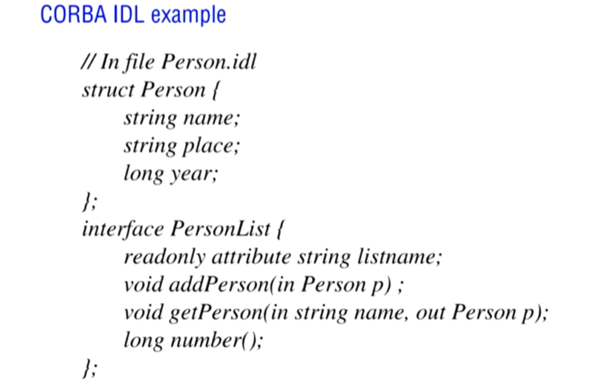
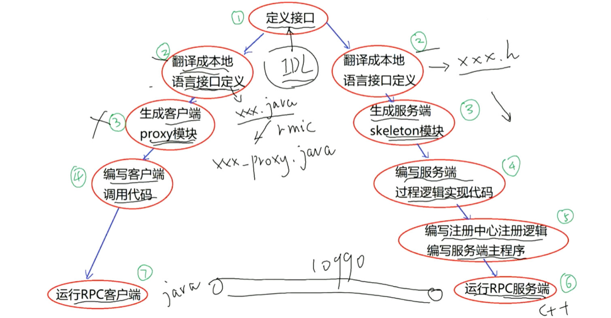
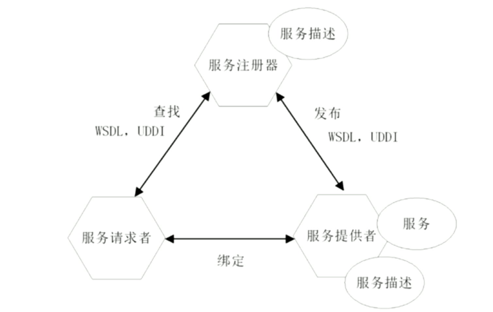

# 分布式系统学习笔记3：接口定义语言 IDL 简述、WebService 简述

**内容几乎全部来源于  西安电子科技大学 李龙海   老师的分布式系统课程。**

我只是老师的速记员

## 接口定义语言IDL（Interface Defination Language）

### CORBA IDL

- 在跨语言环境下，接口的定义开始变得复杂——我们该怎么定义接口长成什么样子呢？我们使用 IDL 来定义支持数种语言的 RPC 接口定义

- 上面是十几年前流行的重量级 RPC 中间件 CORBA 的 IDL

- CORBA 还提供了两个工具：idl2Java 和 idl2CPP，能分别将 .idl 生成为 .java 和 .h，然后两伙人就可以把这俩东西拿走去在上面搞了。这俩玩意都只包含接口的定义（有实现就见鬼了2333333）。 

  

  两伙人的工作流程如上图。协作的交集就只在接口定义部分。

  - proxy 模块的生成需要依据接口定义进行。比如 rmic 工具可以把 xxx.java 生成为 xxx_proxy.java。
  - 支持动态代理技术的语言，就不需要执行这个 proxy 模块生成的工作了（实际上是在语言内部悄咪咪就给干了，只不过不用我们亲自来搞）

### Google Protocol Buffers

Google Protocol Buffers 是一种对象序列化标准和开发库，gRPC 的序列化用的就这玩意。

其可用于网络包格式，甚至可以用于定义文件格式。比如，我们可以用它来定义一个不同语言都可以读写的配置文件（大家把这玩意简称为pb格式，类似于xml、json这些东西，但占用空间远小于xml、json）

## WebService

### WebService 的特色

- WebService 是为了方便网络上不同节点之间互相操作（实现 RPC ）而定义的一套协议标准

- WebService 使用 HTTP 作为传输层协议实现 RPC，原因如下：

- - 解决防火墙问题。绝大多数防火墙都会放行 HTTP；
  - 基础设施丰富，要啥有啥。浏览器多的是，后端 HTTP 服务器软件比如什么 tomcat、IIS、Apache、Nginx 也丰富的很；

- 其主要用于跨企业（B2B）大型业务调用，这种调用不会特别重视效率；

- 使用 C/S 模式

- 支持跨平台、跨语言，面向接口

- 实现面向服务构架（SOA）的重要技术之一：构造一个大型软件时，我们我们使用多个企业提供的服务组合成新的服务（现在就比如各家的 API、SDK）。

WebService 和 我们熟知的自建服务 api 主要区别如下：

1. WebService 直接走80端口的HTTP协议
2. api 是 C/S，WebService 是 B/S（Browser / Server）

### WebService 包含的标准协议：

- 消息编码：xml
- 传输：HTTP、SMTP、TCP、UDP
- 远程对象访问（即，远程方法调用协议）：SOAP（Simple Object     Access Protocol），规定了所有远程调用该操心的玩意
- Web 服务描述语言 WSDL（Web Service     Description Language），和上面的 IDL 是一回事

- 服务目录、服务注册、服务发现 UDDI（Universal     Discovery Description and Integration），定义了注册中心具体实现需要实现的统一的标准接口

- 安全标准：签名、加密、认证等

  

- 服务注册器，其实就是服务注册中心，其往外暴露的就是 UDDI

- Web 服务提供者对外提供的服务，使用 WSDL 对服务进行准确的描述。描述后就要用 UDDI 将 WSDL 注册到服务注册器，这个过程叫做发布/注册

- 服务请求者要发现具体的服务也要通过 UDDI 进行，确定接口的具体定义以进行调用（不过     WebService 行话/黑话 把“调用”叫做“绑定”）

- WSDL 使用 xml 语法

