# 分布式系统学习笔记4：消息中间件

**内容几乎全部来源于  西安电子科技大学 李龙海   老师的分布式系统课程。**

博主只是老师的速记员

### 仅支持点对点通信的缺点

对于复杂的分布式系统，各个节点之间都通过点对点方式进行通信会大大提高系统的复杂度和耦合度。而且由于各个节点之间的通信直接使用 Socket 一对一进行（如果节点和节点之间的通信直接用代码写死），使得扩展性非常差——每次增加新的节点都需要对系统中的多个节点产生影响。同样的，紧密耦合也导致了较差的容错性。

该问题可以通过引入中介节点来解决。

### 引入中介节点

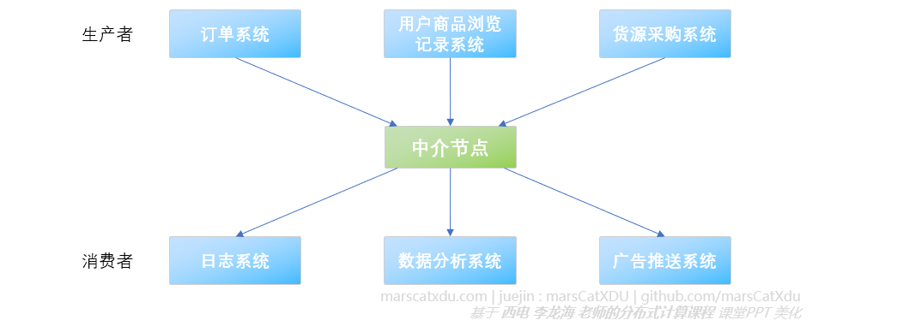

中介节点可以作为一个类似缓冲区的角色加入到系统中，将数据的生产者和消费者分开。该方案的特点和优点如下：

- 降低耦合：生产者会将数据发送到中介节点，消费者会通过某种方式从中介节点获取到所需要的数据（比如通过【主题订阅】模式，“订阅”自己感兴趣的内容）；
- 提高容错性：中介节点可以缓存数据，在部分节点失效 / 速度（短时间内）不匹配时也可以保证数据不会直接丢失；
- 提高可扩展性：生产节点无需关心消费者的情况，消费者也同样无需关心生产者的情况。因此，生产、消费者的增减（类型增减、同类型节点数量增减）均不会对生产者造成影响（如果不需要改变数据结构的话）；

为避免中介节点称为系统的瓶颈，其实际上也可以是一个集群（可以保持逻辑上的单点。这玩意叫【消息队列中间件】，如后面会提到的 Active MQ）

## 面向消息中间件（Message Or iented Middleware，MOM）

该中间件提供了一种分布式消息队列服务，让节点之间可以通过这个中介使用消息进行灵活的**异步通信**。

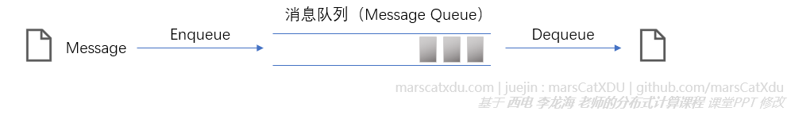

异步通信：发送方把数据放入消息队列，就算完成了数据发送任务，可以去做其他事情了——无需阻塞等待接收方收到信息。接收方也是想收数据就收数据，而不用阻塞等待发来的数据

### 分布式系统的总线构架

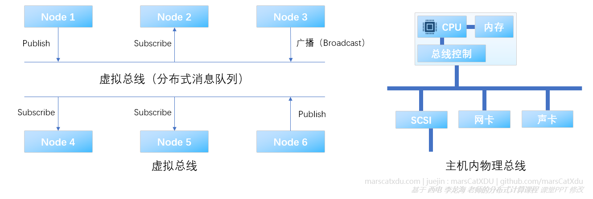

该构架中，各个节点通过（虚拟）总线相连。和主机内部的系统总线类似，要发送消息的节点只需要将数据往总线上“一放”就星了（这里，总线的角色由消息队列来扮演），双方完全不必知晓对方的存在（因为时通过订阅来确定谁需要哪些消息）。

这样的一个 MOM 除了自己的进程，还应提供一个给使用其的客户端的 sdk。客户端通过 sdk 提供的接口与中间件连接（一般会建一个socket）。

中间件连接完成之后，应用对于消息的发送和获取都通过 sdk 进行。比如消费者只需要通过 sdk 提供的接口配置订阅的主题，sdk 即会完成剩余的消息获取工作，并在需要时将获取到的消息返回给应用。

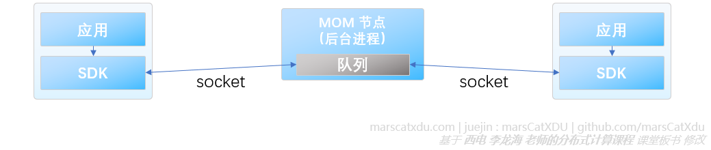

### MOM的两种通信模式

#### 消息队列模式

该模式如上面那张图所示，中间件会在生产者、消费者（两者均可有多个）中间建立一个先进先出的队列，每个消息被某一个消费者取走，即会被在队列中删除（这意味着每条消息只能有一个消费者接收到）。这种模式可以实现**负载均衡**。

因为同一个队列会面对多个请求数据的消费者，因此需要中间件按照某种策略来决定将消息发给谁（一般随机选，或者轮询）。

> ##### 负载均衡
>
> 将大量的任务均衡地分配给多个运行同样业务逻辑的服务器。在性能不足时，可以通过简单地增加服务器数量的方式来提升整体性能。

高级的队列模式：带有优先级的队列（优先级高的多给些消息）、支持持久性的队列（中间件会在磁盘上保留备份，中间件掉电之后能够直接恢复）

#### 主题 / 订阅通信模式

这种模式下，可以有不同种类、生产不同类型数据的生产者，生产者可以选择向特定的消息主题发布消息。多个订阅同一主题的消费者可以同时接收到发布该消息主题的消息，因此该模式可以灵活地实现广播、组播的多对多通信模式。

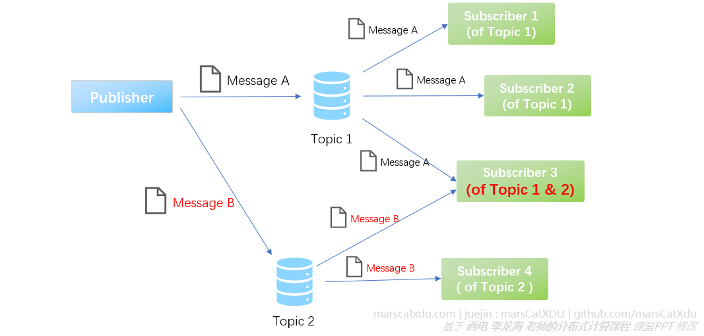

这种模式适用于数个数据消费者都运行各自的业务逻辑的情况——也就是说，同样的一条数据或许会被多个消费者拿去用作不同用途。比如在购物网站中，一个用户产生了一条新的订单数据，该订单数据被放入 MQ 后（也许）就会被多个服务器获取到，用于各自的业务逻辑——比如将订单发送给仓库、将消费数据计入用户账户、将用户购买行为加入分析等。

#### MOM ：ActiveMQ

- ActiveMQ 是 Apache 出品的完全兼容 JMS（Java Message Service，一组用于连接各种消息中间件的 API，为各种中间件提供统一的抽象 ） 的消息中间件，其为多种编程语言提供客户端 API 。

- 中间件和客户端使用 AMOP（Advanced Message Queuing Protocol） 协议进行通信（因此，越过 ActiveMQ 直接在软件底层使用该协议，也可以使用 ActiveMQ 中间件）；

- ActiveMQ 有三种消息接收方式

  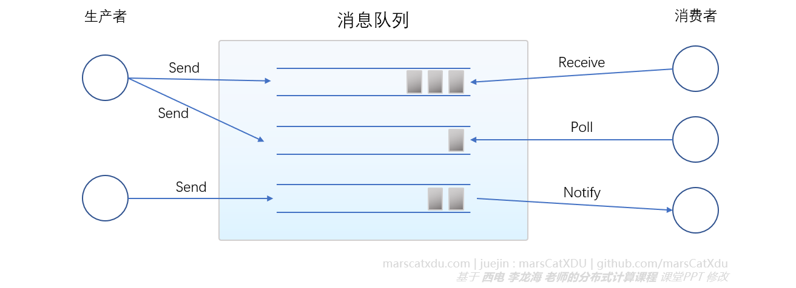

  - 阻塞（同步）：接收函数在队列接收消息，如果队列里有消息则直接返回（返回值就是取回来的消息）。如果队列是空的，则阻塞等待消息；

  - 轮询接收：为了避免阻塞，会提前查询一下队列是否为空，当不为空时进行阻塞接收；

  - 回调接收：注册一个回调函数

    > 回调函数：该函数会在一个模块中进行定义，然后又被注册到另一个模块（注册，就是把回调函数的调用地址记下来）。当另一个模块要用这个函数时，就会通过注册的地址来调用这个回调函数，被调用的回调函数所在模块就可以通过另一个模块的调用参数获得传来的值
    >
    > 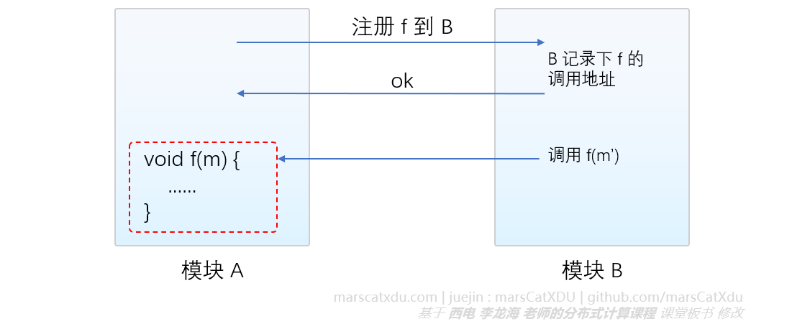
    >
    > 回调函数可用来实现异步通信

    - 回调函数所在模块定义回调函数，并在中间件注册该函数；

    - 当中间件的队列中有消息时，中间件主动调用回调函数并通过回调函数的参数传入值，实现异步通信

      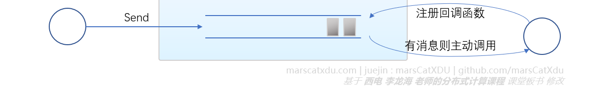

### Java Message Service，JMS

Java 除了语法、JDK 之外，还定义了很多的 API 标准（比如 Java EE ，主要就是包含了非常多的 API 标准），Java 为非常多的其他工具等定义了统一的 API 标准（比如 JDBC 、 JMS）

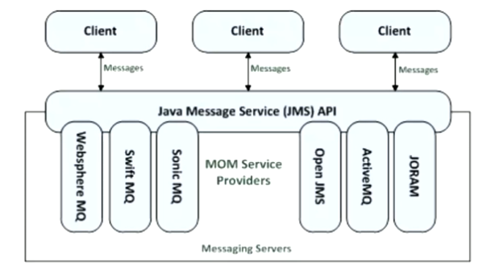

JMS 虽然名字叫做 Service，但事实上其是一套 interface 标准，其为 java 应用程序访问不同的 MOM 中间件提供了统一的 API 接口标准（这就意味着完全通过 JMS API 使用 MOM 的客户端，可以在不修改代码的情况下支持多种中间件，方便进行中间件的切换）

### 基于 MOM 实现通信的优点

- **实现异步通信，减少系统响应时间，提高吞吐量**
- **实现分布式节点之间的解耦**
- （一定程度上）保证消息的可靠递交，实现最终一致性
  - 绝大多数 MOM 都有持久缓存功能，接收者失效重启后可以重新获取所需的消息
- 实现广播、组播和多对多通信
- 实现流量削峰和流量控制
- 支持 Push 模型和 Pull 模型

## 实现可扩展服务的思路

几个服务器运行同样的逻辑，同时连接到同一个消息队列

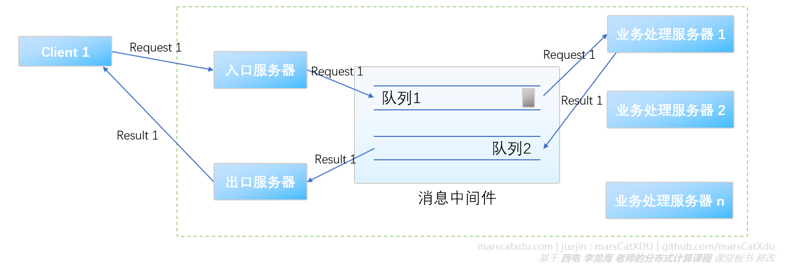

入口服务器接收外部请求，出口服务器为请求返回结果。当入口接收到请求后，将该请求放入消息队列，根据负载均衡策略将该消息发送给特定的业务处理服务器（也可以是业务服务器监听消息队列，主动获取队列中的新消息）。业务服务器完成计算后将结果放入另一个返回结果的队列，出口服务器监听到新的消息后就会将该消息取出并返回给在外部的请求发送者。

这种分布式系统，可以通过增加业务处理服务器性能 / 数量 的方式来实现整体并发业务处理能力的提升。消息队列、入口和出口服务器这三个部分相对不容易成为瓶颈（出入口服务器的逻辑都异常简单，可能就只是从网卡提取个数据包，进行简单检查后送消息队列这么简单。如果成了瓶颈，有些中间件也支持让这三部分以集群形式运行，来进一步提升性能）。

#### 流量削峰

当请求数量暴增、出现数量峰值时，大量的请求将堆积在 MOM 的队列中，后面的业务处理服务器并不会因创建过多响应线程而失效。当运行队列的服务器内存不足时，队列内数据还可以被放入内存继续排队。因此，在面对数量超过处理能力请求时，整套系统的响应速度会下降，但并不会被直接卡死。

#### 该系统的进一步优化

在不提升系统性能的情况下，可以在中间为请求者提供一点反馈来提升使用者的用户体验——入口服务器接收到外部客户端的请求后，立即返回一个表示“已经开始处理”的反馈给客户端，然后开始运行（可能比较漫长的）业务逻辑。在运行完成后，通过异步的方式对外部客户端进行响应（比如发个短信给客户，然后客户端主动到出口服务器发送查询请求）

#### 消息队列的缺点——没有反馈

业务处理服务器不容易对处理过程进行反馈——比如业务处理服务器失效，或者服务器发现请求消息不合法，都无法简单地将异常情况反馈给外部请求者。如果想要反馈就需要增加一个新的用于反馈异常的队列，而这将加大系统的复杂度

#### 业务处理服务器异常补的救措施举例

日志法：系统会将请求内容和处理节点的关系记录到日志中，然后会有一个专门的程序对日志进行扫描。如果该程序发现某条被分配给某个节点的请求响应超时，则会让系统重新对该请求进行处理。

### Push 模型和 Pull 模型

Push ：推送；Pull ：拉取。

上面所写的全都是 Push 模型：客户端（消息源头）不断将请求 Push 进入队列，而对于数据的消费者是否处理得过来全然不顾

#### Pull 模型

数据的传递是被动的——消费者主动到队列中 Pull 消息。当队列中的消息全部为空，队列才会到数据源头要求放入新的消息

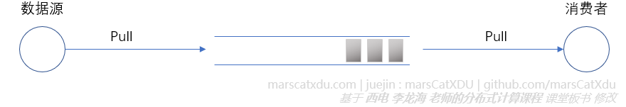

该模型要求源头有数据缓存模式。该模型适合有大量的数据等待处理的数据分析场景

