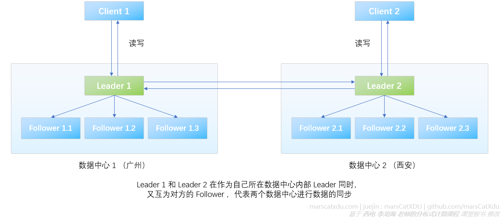
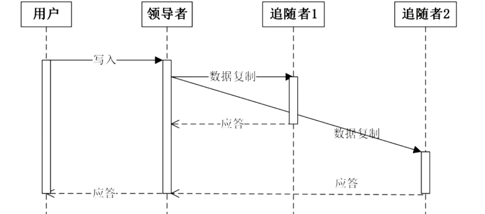
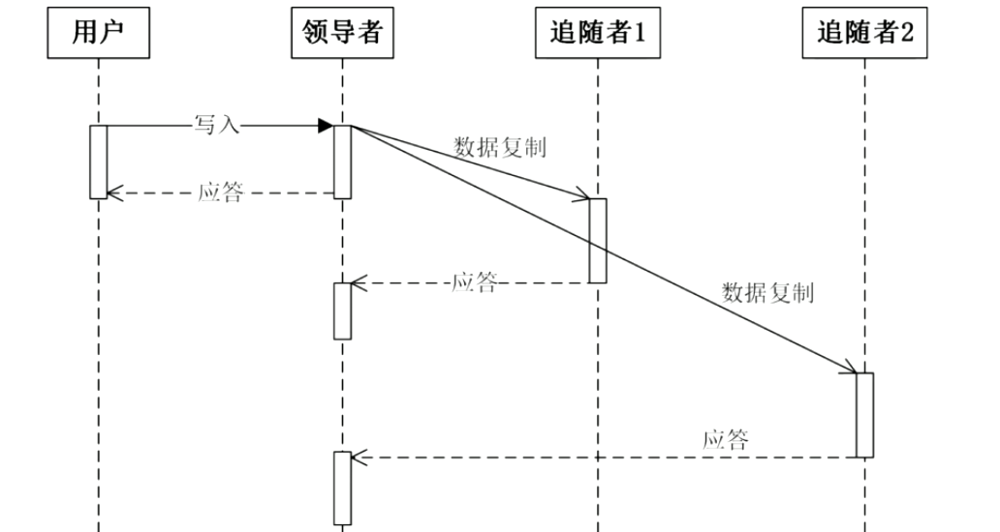
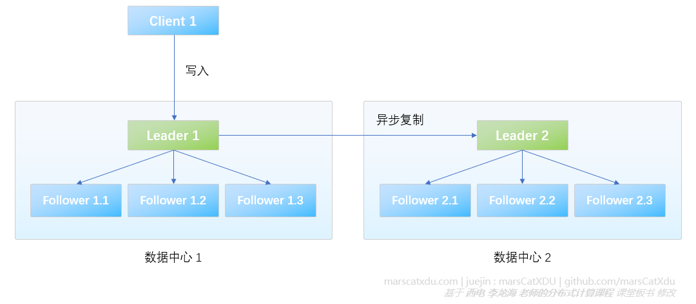
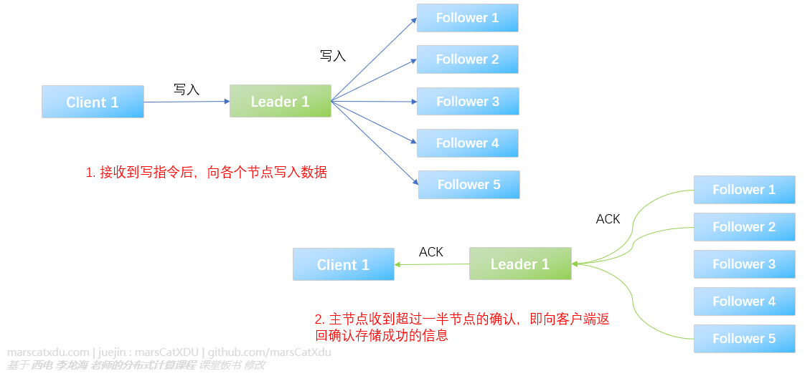

# 分布式学习笔记5：分布式存储（1）分布式存储概述；数据复制；块存储、对象存储、文件存储系统简介及对比

**内容几乎全部来源于  西安电子科技大学 李龙海 老师的分布式系统课程。**

博主只是老师的速记员

## 分布式存储要达成的目标

> 实现分布式存储各项功能的基本手段：复制和分区（切片）

- 提高数据存储容量：让**总体存储容量**随节点增多而增大（水平可扩展）；
- 提高数据吞吐量：让**总体吞吐量**随节点增多而增大（水平可扩展），比如将一个大文件切片存储在多个主机内，要获取该文件时即可同时从多个主机同时进行下载；
- 提高可靠性 / 可用性：部分节点故障时数据不丢失 / 部分节点失效不影响整个系统的数据读写（容错性）；

- （可选）降低数据访问延时：用户可以从地理位置上最接近的节点获取数据（如 CDN，Content Delivery Network，即内容分发网络）；
- 与分布式数据处理系统相配合，提高分布式数据处理系统的运行效率。既然分布式存储可以存储文件，那么也就意味着可以存储代码（可执行文件），这就可以和分布式数据处理系统相配合使用了。“移动程序而不是移动数据，移动计算比移动数据更划算”——若发送处理程序消耗的时间远小于发送待处理文件，那么将程序发送到存储着待处理数据的节点上就非常划算。

#### CDN 例子

CDN 是帮助大型网站分发内容的分布式系统。

新浪会在全国各地部署非常多的 Cache Server ，新浪会在进行数据更新时将数据推送个各地的缓存服务器进行数据缓存。

这里其实要在 DNS 上会搞一个小动作——我们向新浪 sina.com 发送的请求，实际上会被发送到距离我们最近的 Cache Server ，然后从这里来获取内容，以大大提升访问速度。

（这里的“最近”非物理距离，而是访问延迟最低，具体还会和运营商相关）

## 基本手段：复制和分区（切片）

### 复制（Replication）

基本思想：在多个不同节点上保存相同数据的多个副本（Replica）

对数据进行备份，首先能够提供冗余备份——让系统在一些节点失效的情况下仍能正常进行数据服务。其次，多个数据副本的存在也能够提高数据的吞吐速率、改善访问数据的性能。

而数据的多备份也带来了一些问题：

- 多备份带来的占用空间的倍增，直接导致硬件成本的上升；
- 数据变更时会引发多副本一致性的问题。比如服务器发生异常重启之后该如何重新和系统整体的当前状态进行同步。

> ##### 处理失效的 Fail-Stop-Recovery 错误模型
>
> 商业服务器系统中会有一个“软件狗”（有软件方案也有硬件方案），其会不断监控服务器机组是否正常运行（比如定期发送请求，检查服务器是否能够正常响应）。如果服务器出现问题（ Fail ），软件狗就会自动对失效服务器发送 reset 指令进行重启（ Stop ），重启后重新启动并恢复服务（ Recovery ）

### 分区（Partitioning）

基本思想：将一个大的数据文件 / 数据库拆分为较小的子集（这个拆分就叫做分区Partition / 切片Shard），并存储在不同的节点中。分区能够提高吞吐率（并行读写）和可靠性（部分节点失效只会部分丢失，如果文件使用了纠删码存储则可在部分丢失的情况下恢复丢失部分），并可以在和分布式计算结合的场景中，为数据并行处理提供方便（比如后面会提到的 Map-Reduce ）。

但分区也会带来如下问题：

- 跨区查询问题（分布式索引问题）；

  比如我们将一个巨大的 SQL 数据表拆分为了多个子表，不同的子表存在不同的服务器中

- 合理、动态分区问题（大数据如何拆分。不同的分区访问频率不同，某些分区可能突然称为访问量突增的热点）；

- 负载均衡问题（各个分片如何合理分配给不同节点）；

- 分布式事务处理

#### 例：数据库的复制和分区

MySQL 数据库在一个数据表超过百万条记录后，其查询效率就会出现明显的下降。解决该问题的有效方法就是拆表

（拆表需要注意拆表的方法，不良的拆表会引发频繁的跨表查询，降低查询效率）

该方案根据主键范围进行分区，同时进行双副本备份

#### 多副本需要解决的问题

- 数据更新时的一致性问题（后面会讲 Paxos）；
- 负责存储的节点选择问题（如何兼顾性能和可靠性？）
  - HDFS 会将三个备份中的两个放在同一个机架的两个节点中，而第三个副本会放在另一个机架上的节点中，如果有第四个副本就要放到更远的机架上（也可以选择异地）。这种方案可以兼顾效率和可靠性。
  - 可靠性：同一个机架使用同一组电源和交换机，电源或者交换机挂了就一挂挂一架；
  - 效率：同一机架内的服务器使用同一组交换机，在同一机架内的不同服务器互相访问速度最快，而且机架内通信不会影响其他机架通信。
- 访问数据时如何查找副本所在节点的问题（后面讲 HDFS 的时候会讲）。

## 数据复制

#### 复制策略：基于领导者的复制（Leader-based Replication）

aka. 主动/被动（Active / Passive）复制、主/从（Master / Slave）复制、主/备（Primary / Backup）复制

基本思想：

- 副本之一被指定为领导者（主库），其他副本则被指定为追随者（从库）；
- 客户端要向数据存储系统写入数据时，必须将请求发送给领导者。领导者会将新的数据写入本地存储，同时将变更发送给追随者；
- 客户端要读取数据时，向领导者 / 追随者查询均可；
- 适合读多写少的场景

示例：三个同步的 MySQL 数据库，只通过主库写入，但能通过三个库读取

#### 复制方法分类

##### 单主复制

- 一个领导者，多个追随者。适合读多写少的场景，但主库是性能瓶颈，又是单点故障节点（Single point of failure，设计分布式系统的最大忌讳）
- 提高容错性手段：在主库挂掉后，（可以手动或自动）选择一个从库成为新的主库，但自动切换会面临**脑裂问题**（分布式系统中的典型问题）
- 各个从库一般靠心跳包超时判断主库失效。但超时并非一个可靠的办法：主库可能由于处理某些耗时操作而没有及时回复心跳包，导致它在其他节点已经选出新的主库后仍认为自己是主库。此时，系统中就会同时有两个发出主库指令的节点存在，造成脑裂（后面会在 Paxos 中说明如何解决该问题）

##### 多主复制

- 有多个主库接受写入操作，每个主库将数据更改转发给所有其他节点，每个领导者同时也是其他领导者的追随者。可以提高写入性能，但一致性实现会更加复杂；

- 适用场景：多数据中心之间的复制、协同文档编辑（类似 Git ）

  

##### 无主复制

- 没有主从库概念，客户端直接将写入请求发送给各个副本服务器。或，客户端将写入发送给某个节点，由该节点充当代理节点向其他节点转发写入请求（代理节点只代替客户端做转发工作来扩散写入请求，而不像主从复制中的主节点一样进行其他工作）。

### 同步复制和异步复制

同步、异步复制是两种具体处理应答的实现方式。

#### 同步复制

领导者接收到数据更新请求后，首先将更新的数据写入自己的数据存储器，同时将数据更新请求广播给从库。待确认所有从库更新完成后再向用户返回先写入成功的应答。

该方式容易实现副本之间的**强一致性**，但写入速度慢，且一个节点的失效便会导致整体写入失败。

时序图如下

领导者在将数据写入本地的同时将数据写入指令发送给所有的追随者，所有追随者给出写入成功的应答后，领导者再给客户写入成功的应答。

#### 异步复制

如图所示。领导者本地写入成功后即对用户给出应答

该方式写入效率更高，响应速度快。但很容易造成主从库数据不一致（性能差距、网络环境都会造成影响）

#### 混合复制

部分节点同步复制，部分节点异步复制

在这个例子中，左侧数据中心的主库和从库进行同步复制（距离近，速度快，应答速度快）。两个数据中心之间进行异步复制

在一些如 Raft、Paxos 的算法中，可以采用一种与上面两个都不同的方式：主库接收到一定比例（比如超过一半）的从库应答后，就会对用户发出应答

在 HDFS 中，使用“流水线”应答，逐级发送写入请求，逐级返回应答。而且并非一次写一整个数据块，而是每次只写一小块（比如 64kB ），全部写完再给 client 返回应答

异步复制只能实现**最终一致性**

#### 强一致性、最终一致性

强一致性：在外部来看，该分布式系统的行为表现和本地完全一致（比如银行，如果不支持强一致性可能会导致双花等问题）。

最终一致性：随着时间的推移，最终系统中的所有节点会达到一致的状态（比如微信、微博等普通的互联网应用。不能保证每个时刻都读到最新版本，但随着时间的推移总会读到最新版本，且不会发生顺序错误的问题）。

不能保证一致性的系统，从不同的节点会获取到互相冲突的值

### 更新日志

副本节点的数据更新一般分两步进行：先将更新操作追加进更新日志，再根据操作参数更新本地存储系统（或称为本地状态机）。日志可以帮助落后的追随者追上领导者的最新状态，也便于实现分布式事务

实际上，单机系统的数据库也是要建立日志的：因为一次的更新未必是一个原子动作，实际上一个操作往往由数个原子操作组合而成，而这几个子步骤执行的过程中是有可能出现意外的（比如掉电、断网）。因此，日志可以帮助系统在这种造成混乱的情况下进行恢复 / 重做未完成的动作（实例如数据库的 B树）。在某些设计中，写入请求成功追加到日志后就可以应答用户，可以提高写入速度（因为数据库写入是随机读写而追加是顺序读写，速度会有明显的差异，大概 2-3 倍）。

此外，由于日志保证了全部的更新历史，也便于在出现错误时进行问题的回溯

将 Leader 的更新日志复制给各个 Follower，即可实现最终一致性。这里使用了**复制状态机**（ Replicated State Machine ）的思想——每个节点运行的节点维护进程都是一个状态机，只要日志是一致的，那这些状态机就一定能达到一致的状态，这就叫复制状态机。（以太坊就是复制状态机）

但日志的存在也会造成问题：日志会越来越长。解决方案就是周期性保存系统快照，并不再保留之前的日志。这样如果一个追随者落后非常多（比如加入全新节点），也就可以先复制快照然后再使用日志进行追赶。

## 块存储、对象存储、文件存储系统

**该部分内容来自互联网，博主在此只对阅读的数篇文章中自己感兴趣的部分进行内容裁剪和重组**

### 块存储

典型设备：磁盘阵列、硬盘、虚拟硬盘等。

块存储主要将裸磁盘空间整个映射给主机使用。例如，我们可以将多块硬盘组成一个硬盘阵列，然后通过划分逻辑盘、Raid、LVM 等方式在这几块磁盘之上划分出数个逻辑硬盘。

接下来，块存储将这几个逻辑盘映射给操作系统，这几个逻辑盘和物理盘的区别在操作系统层面不可感知。因此，操作系统还需要像使用真正的本地磁盘一样，对这些逻辑盘进行分区格式化才能正常使用。

#### 优点

- 能够通过 Raid、LVM 等方法对数据提供保护；
- 能够将多个小容量硬盘组合为一个大容量的逻辑盘；
- 写入大文件时，文件能够在几个物理盘进行并行写入，能提高速度；

#### 缺点

- 磁盘无法实现主机之间的数据共享；
- 在多个操作系统使用不同文件系统的情况下，难以进行跨操作系统的文件共享；

#### 使用场景

- docker、虚拟机磁盘
- 日志存储
- 文件存储

#### 常见类型

##### DAS，Direct Attach Storage

该方式直接将磁盘连接到服务器主机，每台服务器都有独立的存储设备，跨主机数据共享困难。适用于性能要求不高的场景

##### SAN，Storage Area Network

使用光纤连接的专业服务器的存储方式。SAN 系统位于主机群的后端，能够承载高性能、高安全性需求的应用。能提供高随机 IO、高带宽、低延迟，但成本高且扩展性较差，无法满足千级以上 CPU 规模的系统

### 对象存储

典型设备：内置大容量硬盘的分布式服务器

对象存储就是通常意义上的键值存储，接口就是简单的 GET、PUT、DEL 等

该方式结合了 SAN 和 NAS 的优点，能够通过直接访问磁盘来提高性能，也能够共享文件和元数据以简化管理。

对象存储的核心是将数据读写和元数据控制分离（也就是数据流和指令流分离）

对象是系统中数据存储的基本单位，一个对象实际上就是文件的数据和一组属性信息（Meta Data）的组合，这些属性信息可以定义基于文件的RAID参数、数据分布和服务质量等，而传统的存储系统中用文件或块作为基本的存储单位，在块存储系统中还需要始终追踪系统中每个块的属性，对象通过与存储系统通信维护自己的属性。在存储设备中，所有对象都有一个对象标识，通过对象标识OSD命令访问该对象。通常有多种类型的对象，存储设备上的根对象标识存储设备和该设备的各种属性，组对象是存储设备上共享资源管理策略的对象集合等。

### 文件存储

典型设备：FTP、NFS 服务器

一般支持 POSIX 接口，但也有例外如 GFS、HDFS

主机只需安装软件即可提供文件存储服务，而且无需对本地磁盘进行格式化处理

#### 优点

成本低，文件共享便捷

#### 缺点

性能较差

#### 常见类型

##### NAS，Network Attached Storage

性价比高，基于 TCP/IP 实现，可扩展性好，易于管理。但协议开销大、带宽低、延迟大，不适用于高性能集群