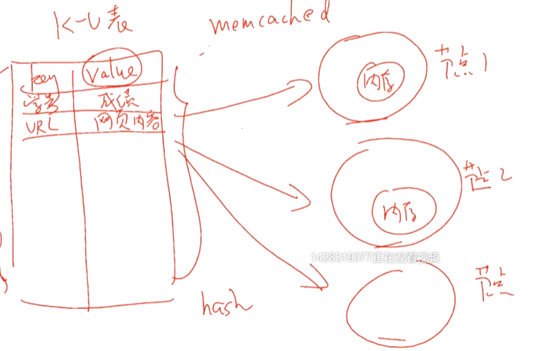
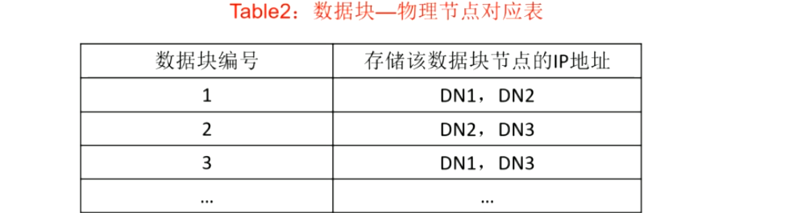

# 分布式学习笔记6：分布式存储（2）数据分区、分区与复制的组合使用、HDFS 简介

## 数据分区

> 将一个大的数据文件 / 数据库拆分为较小的子集（这个拆分就叫做分区Partition / 切片Shard），并存储在不同的节点中

数据分区能将数据存储和访问的负载分散到多个节点。合理分区的目标是将负载在各个节点均匀分布，避免出现偏斜（skew）和热点（hotspot），且分区需要兼顾跨区查询问题。

### 根据主键范围的分区

应用层遇到的绝大多数数据都可以找到一个唯一的标识来作为其主键

#### 均匀划分

假定我们有一个数据的取值范围是 0-N，要存入 N1~N4 这四个节点，那么就可以**【按主键范围均匀划分区间】**：把数据四等分，分别存入四个节点

优点：数据均匀划分，每个节点管理的数据相等，实现存储的负载均衡

缺点：没有针对【热点区间】进行优化，使存储热点数据的服务器承受过大压力。（在实际运行时，相对被频繁进行访问的文件切片被称为热点区间）

#### 非均匀划分

针对热点区间的情况，将一些不常用区间合并，将热点区间继续进行划分分到不同的服务器中，使【查询负载均衡】

但这种划分方式难以实现根据热点转移重新进行动态划分，且由于划分不均匀，还需要额外维护一个**全局索引表**，其保存 key 范围到存储节点的映射，进行查询时需要先查询该表

然而，这样的一个全局索引表同样也需要维护，维护该表的“主节点”就会成为单点失效节点

接下来介绍一种不需要全局索引表就能够解决数据热点问题的解决方案

#### 使用 Hash 进行分片

> Hash 函数的输入和输入的对应是随机的，但对于相同的输入则一定能给出相同的输出；
>
> Hash 值是难以碰撞的，假定函数会输出 n bit 的整数，如果我们任取两个值进行输入，则输出值相等的概率为 2-n

分片示例：将整个 hash 值空间均匀划分为与存储节点数量相等的空间，并据此将所有的数据在这些节点间进行均匀的分散存储

这样的分区是随机的，数据均匀分布。而由于数据的热点一般是连续的，这么一来热点区域也被分散存储了，实现均匀分布。

这种方式**无需全局索引表**：客户端可以自己通过数据的 key 值算出来该数据被存储的位置。

但这种方案的缺点也比较明显：会导致连续数据访问效率低下，且在增加或减少存储节点时会遇到困难——需要重新进行数据的移动。

##### 基于一致性 Hash 算法的分区

一致性 Hash 算法将整个 Hash 区间做成一个环，如下图中的 Hash 区间是 32 位，在做成一个环后

每个节点都有自己的唯一标识（比如 ip），我们对该标识取 hash，这样我们就能够将节点映射在该环上。理想状态下，如图的四个节点应该能够在 hash 环上均匀分布，这样一来，每两个节点之间就会有一个 hash 值区间了

这样一来，我们就可以人为规定：上游节点和下游节点（比如 node1 和 node2 ）之间的 hash 空间都由下游节点负责 （例如区间 1 就由 node2 负责）

当任意一个 key 输入后，我们就可以根据该 key 的 hash 值落在的空间来为其指定存储节点了

当我们增加新节点 node5 时（假定其落在 node2 和 node4 中间），就只需要将 node4 的部分数据传输给 node5 即可，对于其他节点则无任何影响

一些 p2p 存储系统也使用一致性 hash 算法——所有网络中的节点都被映射到 hash 环上，将大文件分块（使用 【文件名 + 块 id】 作为主键取 hash ），分块的 hash 落到哪个空间中则其存储就由相应的节点负责

##### MemCached

MemCached 是一个开源高性能分布式内存缓存服务器软件，为开发者提供了客户端库，可以方便地进行使用。其相比 Redis 性能更强但功能稍弱。

MemCached 使用 kv 存储模型，相当于将一个巨大的内存 HashMap 分布存储在多个 MemCached 节点上，常用于缓存数据库查询结果以减少数据库访问，实现对响应速度的提升。

（每次外部请求进行一次新的数据库查询，MemCached 会将查询结果缓存进入内存，对于同样的查询则直接从内存返回）

该 kv 存储的内容可以非常灵活，如果一个节点内存装满了，可以将该表使用 hash 切片存储到多个节点上。使用工具库开发的应用就可以在逻辑上认为自己有一个巨大的 kv 表即可，而无需关心分布式存储的内部原理。

## 分区与复制的组合使用

一个长度为 length 的大文件在 HDFS 中切片存储——按照字节偏移量每 128MB 进行均匀分区，最后一个分区若不满 128MB 则同样独立存储

对于该例子中大文件的第一段 P1 会以流水线的模式写入到 HDFS 中——首先直接写入 N1 节点，再由 N1 来向其他节点进行写入 N2 ，N2 再将 P1 写入 N3 。该分片由 N1 管理，N2、N3 都是 N1 中分片的备份

对于后续的其他文件分片，都要进行同样的操作。但该分片的管理可能由其他节点进行（而不全是 N1）

下图描述了这种分片和复制组合使用的示例：某个节点可以是某个分片的领导者（主库），自身同时又是其他领导者的追随者（从库）

## Ceph 简介

Ceph 是被广泛应用的开源分布式文件系统，已被集成进 Linux 内核，同时支持块存储、对象存储、文件存储。

对于块存储，其可以将多个物理硬盘虚拟为一个逻辑硬盘（比如整一个 1000TB 的），直接被挂载到虚拟机上作为一个大硬盘使用。

## HDFS 简介

分布式文件系统将分布式系统中多个节点的存储资源整合在一起，向用户 / 应用程序呈现统一的存储空间和文件系统目录树，用户无需关心数据具体存储在哪个节点上。大文件则可以被自动分块并分别存储到不同的节点上。为提高可靠性，分布式文件系统还会进行多副本备份。

- HDFS 采用主从构架，网络中始终存在一个主节点，即下面的 NameNode 服务器；
- HDFS 中有两种节点：NameNode 和 DataNode。前者是负责管理的主节点，后者是负责具体数据存储的从节点。NameNode 服务器需要维护整个文件系统的元数据（文件名、文件长度（即以字节为单位的大小）、文件所有者、创建日期等）、管理其他的数据节点（ DataNode ，存储文件的实体数据 ）、进行多拷贝维护和管理存储的负载均衡；

- HDFS 中的所有文件都会被拆分为数据块，每个数据块大小的典型值是 128MB （但具体大小可以手动设置）。比如一个 300MB 的数据就会被拆分为三个数据块，分别为 128、128、44MB ，而每个数据块都会有一个全局唯一的编号 。即使最后一个数据块实际使用空间不足 128MB ，也会单独占用一个 128MB 的空间。因此用 HDFS 存储的应该是 GB、TB 级别的大文件；
- HDFS 更适合一次写入、多次读取的应用场景，可以将内容追加到文件末尾，但不能改前面已经写好的部分。这种设计是为了保证一致性；
- HDFS 适合于进行大数据存储并进行分析，一次写入不再修改。（频繁修改场景还是适合用传统的关系型数据库）

为了实现分布式存储的功能， HDFS 的 NameNode 节点会**在内存中维护两个表**（在内存中可以加快查询速度），这两个表在硬盘上的备份会以日志的形式进行（ HDFS 中的日志叫 Journal ）。HDFS 中还有一个专门的 backupNode 专职负责备份，同样会保存日志。

NameNode 对于元数据使用一种叫做 “ Checkpoint ” 的东西进行保存（实际上就是快照，定期进行整体的落盘备份）

正因为这两个直接关系到文件存储的表都存在内存中，而大量的小文件将耗费大量的内存空间，因此 HDFS 不适合存储大量的小文件。如果非要用 HDFS 存小文件，则需要在应用层对小文件进行打包、解包以及建立索引，配合 HDFS 进行存储。

### HDFS NameNode 维护的两张表

#### 文件名-数据块对应表

大文件按照文件的主键的连续范围进行分区，以大文件中数据所在字节的偏移量为主键。

在 HDFS 中，每个数据块都有一个全局唯一的编号。每个文件最后一块的大小要通过文件长度值进行计算（前面所有的块大小都是相等且已知的）。

#### 数据块-物理节点对应表

以双备份策略为例，每个数据块都会在两个节点上存储两个副本

此处使用双备份策略，所以每个数据块对应两个地址

在实际的 HDFS 应用中，对文件的读请求要通过一个 Proxy 进行。过程如下：

1. 为 Proxy 提供读取指令及参数后（如：/user/bob/file2  offset=0  length=10），Proxy 会将读请求发送给 NameNode；
2. NameNode 通过查表确定该文件所在的数据块以及数据块对应的一组 DataNode 的 ip地址（上面的例子中，就是DN1、DN3 ），并将该位置返回给 Proxy；
3. 客户端根据某种规则来选择读取数据的节点（比如选一个延迟最小的），直接连接到该节点进行实际的数据读取。

客户端在从 NameNode 获取到元数据之后，可以将这些信息缓存下来。而且实际的数据传输都是 DataNode 和客户端直接进行的，与 NameNode 只会进行简单的交互，因此并不会对 NameNode 产生较大的压力

#### 读流程

读取数据时，需要 **路径及文件名、偏移量、读取长度** 三个参数。该参数首先发送给 NameNode 服务器。服务器首先查询【文件名-数据块对应表】，确定从偏移量开始的文件长度这么一块空间落在哪个数据块中，然后再根据这个数据块去查【数据块-物理节点对应表】，并将查询得到的物理节点地址返回给发起查询的客户端。客户端就可以根据该地址去寻找服务器、获取数据了

#### 写流程

客户端向 NameNode 发出请求，NameNode 选择三个 DataNode 并将这三个节点的地址返回给客户端，客户端获得到三个地址后将这三个地址串成一个流水线——客户端仅直接将数据写入第一个 DataNode，然后该 DataNode 负责将数据传给第二个，第二个再传给第三个，完成写入。

### Hadoop 生态系统

