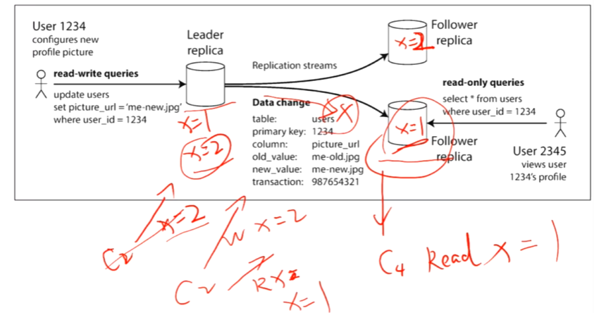
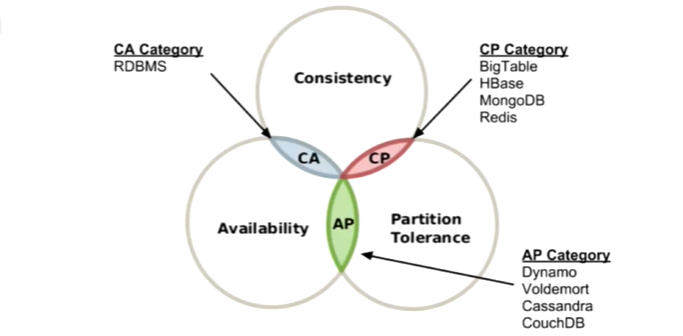
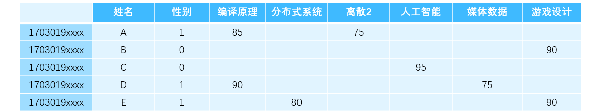
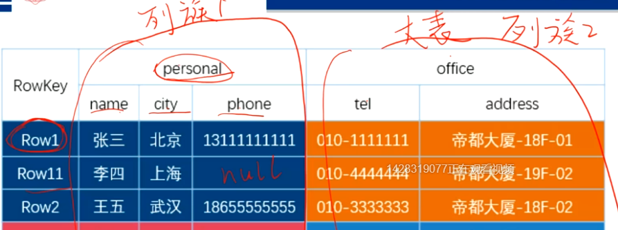
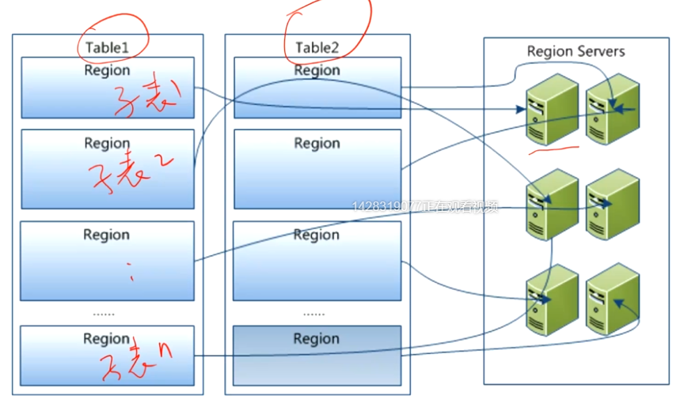
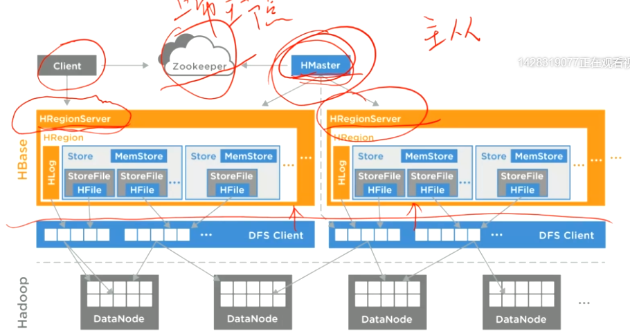

# 分布式学习笔记7：分布式存储（3）一致性、CAP 定理、NoSQL HBase

**内容几乎全部来源于  西安电子科技大学 李龙海 老师的分布式系统课程。**

博主只是老师的速记员。

本课程是面向普通本科生的课程，内容非常简略、浅显，适合任何人作为“导论的导论”来阅读。

## 一致性

在多个客户端同时对分布式系统进行读写的情况下，由于网络不可靠、节点失效等问题的存在，使分布式系统需要想办法解决一致性的问题。

数据一致性模型：客户端读写数据时，分布式存储系统为客户端提供的关于数据外在表现的保证

分布式存储系统设计的最高目标，是让该系统从外界看来的表现应该和一个本地的磁盘相同——比如无论什么时候进行写入和读取（例如，写入和读取的间隔极短），该系统都能够给出符合期望的结果。

### 一致性分类

- 强一致性（线性一致性 / 原子一致性）

  - 在客户端看来，该系统的表现和单副本存储系统完全一致；

  - 只要一个客户端完成写操作，其他所有客户端从系统中读出的数据必须是刚刚写入的最新值。

    比如在单主异步复制的场景中，主库在很短的时间内接收到两个写入请求：x=1 和 x=2，若在主库广播第二条写入的时候突发了一个较大的延迟，导致该更新在其中一个从库没能在外部客户端连接到该库读取 x 值时更新，这样外部客户端就会读到较早版本的值 x=1，而不是最新版本的 x=2 。这就出现了数据不一致的情况。
    

    除了这样的问题，还可能会出现“时光倒流”的问题，即由于通信等问题的影响，导致实际更新顺序和写入顺序不同——先提交的更新较晚生效

  - 最理想的分布式系统应提供强一致性保证

- 顺序一致性

  - 不同的客户端操作生效的先后顺序没有强制要求，但必须是原子的，必须全局达成一致
  - 单个客户端发起的操作生效顺序必须和编码时的顺序一致；

- 单调读一致性：同一个客户端对同一个记录多次读取，每次读出的值不会是更旧版本的值（读到的可以不是最新的，但不会是比最近一次读到的更旧的版本，即不会出现“时光倒流”的问题）。实现方法可以是让从库在应答客户端前先向主库请求进行数据版本比较；

- 最终一致性（分布式系统的最低标准，最容易实现）：**分布式系统停止更新时**（即主库不再更新），所有读操作都能获得最新版本的数据。

一致性越强，实现成本越高、性能越差。因此可以通过牺牲一部分一致性来获得更好的性能和一致性。比如使用单主复制的异步复制方式能够实现最终一致性，但效率非常高。

简单的强一致性实现示例：

- 所有客户端都从主库进行读写，这种情况下从库只是备份。

稍加改进的方案：客户端从所有的库上读取数据的版本号，然后从版本号最高的从库获取数据

## CAP 定理

Consistency （一致性）：不同节点数据的强一致性；

Availability （可用性）：发出的请求在规定时间段内总能返回结果（响应快则可用性高）；

Partition Tolerance （分区容忍性）：允许部分节点和其他节点发生分区（原本的一个网络分裂为两个部分）；

CAP 定理：设计分布式系统时只能三选二（实际上，P 是最基础的，必须存在）

选择 AP 的例子：客户端直接请求的节点失去了和其他节点的联系，该节点此时不确定自己的数据是否是最新的，但由于要保证可用性，因此即使该节点明知道自己的数据可能有问题仍要将结果返回给客户端；

选择 CP 的例子：客户端直接请求的节点失去了和其他节点的联系，该节点此时不确定自己的数据是否是最新的，但由于要保证强一致性，因此该节点要拒绝返回任何数据。

如果节点之间的连接永远不会断（至少是假设的），那就可以选 CA 了（比如传统的关系型数据库，这些数据库或许支持分布式，但都会假设网络不会断）而 NoSQL 往往是为大型分布式系统而生的，优先支持可扩展性（可以随意增加节点，几乎无限扩充）。选择 CP 的 BigTable、HBase、MongoDB、Redis 在系统网络出现分区的时候就不可用了。

### BASE 理论（基本可用）

尝试以妥协来尽量追求 CAP 三者在一定程度上的的兼得

核心思想：即使无法做到强一致性，但每个应用都可根据自身业务特点降低一部分一致性以获得可用性。

- 基本可用（Basically Availability）：出现故障时允许损失部分可用性，但保证核心可用；
- 软状态（ Soft State ）：允许系统中的数据存在中间状态，允许系统在各节点的数据副本存在延时；
- 最终一致性（ Eventually Consistent ）：一定期限后保证达到最终一致性

## NoSQL

虽然有些关系型数据库也支持分布式，但做不到性能随着节点数量的增加而线性增加

NoSQL 追求分布式可扩展性和性能，一般采用非关系模型

往往通过牺牲一致性、放弃某些复杂的查询操作（比如 HBase 虽然存储的也是表，但并不支持跨表连接查询等复杂的查询操作）、增加数据冗余（采用反范式设计）、放弃复杂事务等方式来提升可扩展性、可用性和性能

数据模型：

- K-V 模型，想要实现更复杂的应用都可以在应用层来搞，如 Redis ；
- 列存储模型（稀疏表模型）：如 HBase；
- 文档模型：把文档作为基本的存储单位（原子记录）进行存储，如 MongoDB ；
- 图模型：不需要像 SQL 一样，将图转化为二维表存储，如 Neo4J、FlockDB；
- 对象模型；

## HBase

- HBase 是构建在 HDFS 之上的**面向列的分布式数据库管理系统**

  > “HBase 构建在 HDFS 之上”，意味着其数据文件全部存储在 HDFS 之中，其对自身管理的数据文件的操作也都要通过 HDFS 提供的 API 来进行。此外， HBase 还依赖 Zookeeper 来实现多节点的协同动作。

- HBase 采用稀疏表数据模型，方便结构化、半结构化甚至非结构化数据的存储

  > 稀疏表：该表的列数可以非常多，而且中间可以有非常多的空位（即字段为空），如下图所示。有这样多空值的表在 sql 数据库中是无法接受的，因为 sql 中表格空值也会占据空间，这样会造成很大的浪费。
  >
  > 
  >
  > 此外，这个表的列数可以非常非常多

- HBase 避免了 HDFS 的“一次写入”缺陷，支持数据的随机读写

  > 不同于传统数据库的B+树索引，HBase 通过 LSM 索引结构，使用类似于追加日志、同一个值只读取最新版本的方式来实现修改已有数据。旧版本垃圾数据问题通过 HBase 本身的定期清洗来解决；

- 宏观上，HBase 管理多张可分布式存储的“大表”，理论上行数无限（支持横向给扩展），列数也可以非常多

  > - 空间不够了可以加存储节点而不会影响性能。对比而言，mysql 这类传统数据库在行数达到百万、千万数量级时，其性能就会有明显的下降
  > - HBase 的列数也可以非常多，存个一千多列的表并不算什么问题

- 该表的每一行都有一个唯一的 “ RowKey ” ，HBase 关于每个数据表的 RowKey 列都建立了分布式索引，可以根据 RowKey 快速访问行，也可以指定 RowKey 范围进行查询（相当于有一个主键叫 RowKey 。使用 RowKey 的查询和存储规模无关）

- 支持数据分区：每个大表按照 RowKey 的连续范围划分为多个子表，分散给不同服务器管理（RegionServer）

- 支持 “列族” 概念，同一个列族的数据会尽量放到同一个 HDFS 文件中，能显著提高访问整个列族时的性能

  

- HBase 只支持行级事务，不支持复杂事务，单行数据的读写都是原子性的。不支持对 RowKey 之外的列建立索引，也不支持多表连接查询

- HBase 的数据分区，不同的子表分配给不同的子表服务器

  

- 子表分裂、子表合并：HBase 会自动保持每个 Region 的大小适中

### HBase 的体系结构

HBase 采用主从架构，具体的子表管理由 HRegionServer 进行。

HBase 进行查询时需要先到 Zookeeper 查询分布式索引的树根，接着就可以直接用这个树根去查所需的大表中的记录了，并不需要通过 HMaster。

HMaster 存储了所有 RegionServer 的负载情况，能够管理子表的分裂、合并，以及为新建的表分配 RegionServer 。

在 HBase 中，每个表有一个特定的 RegionServer 进行管理，每个 RegionServer 可以同时管理多个子表。