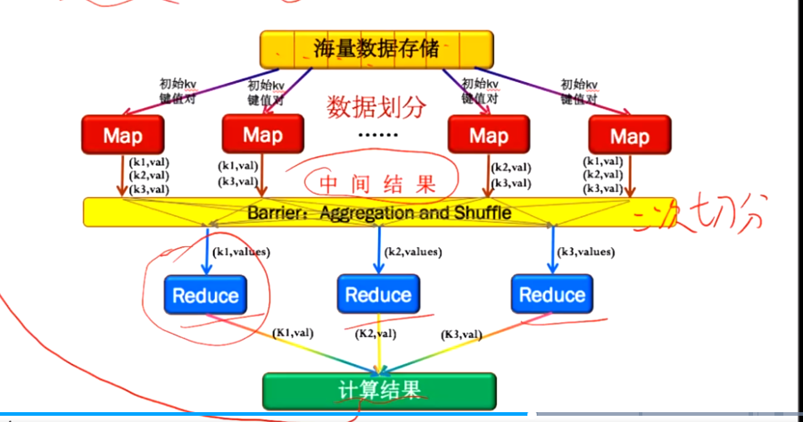
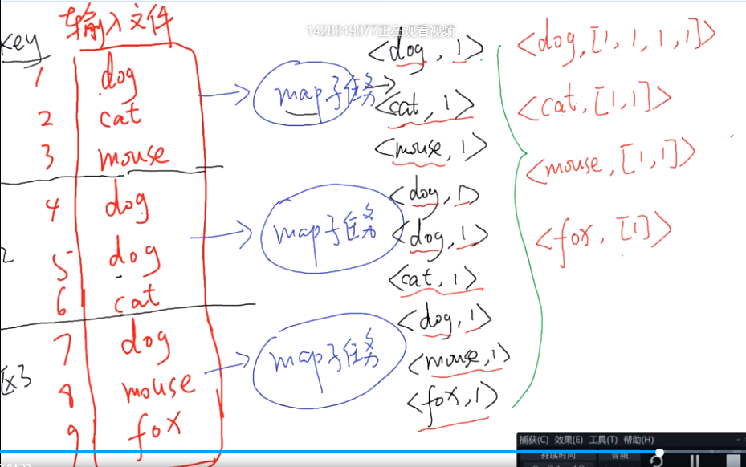
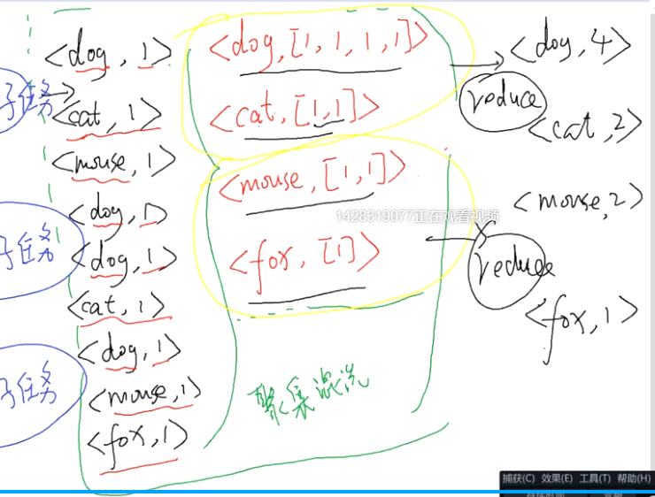
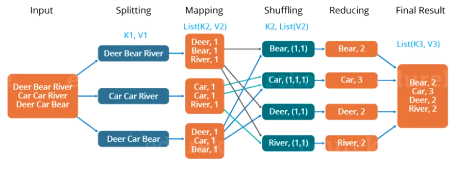
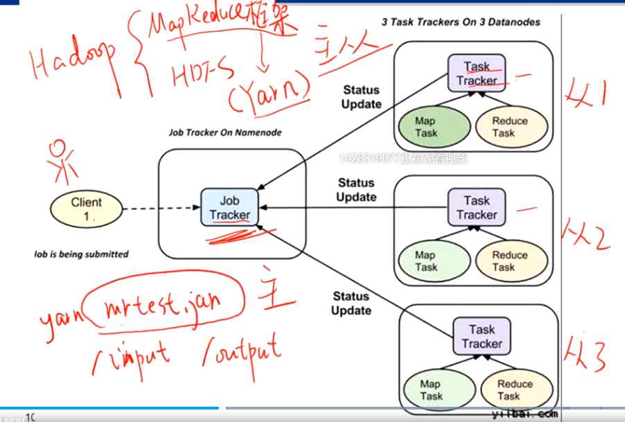
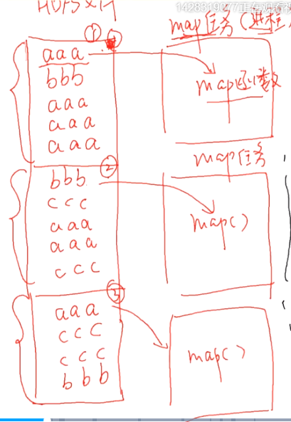
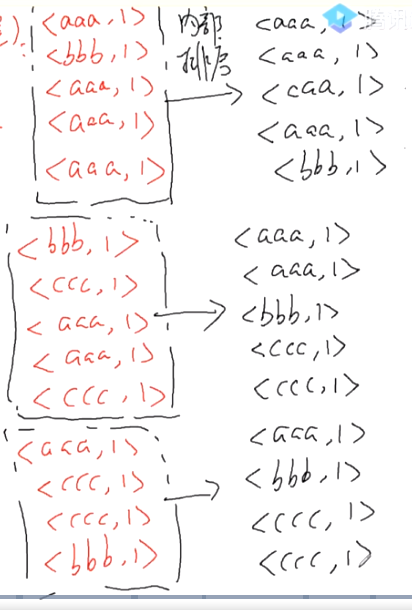
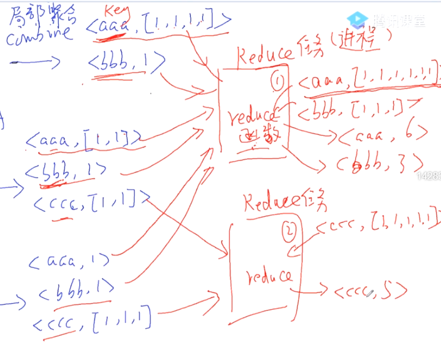
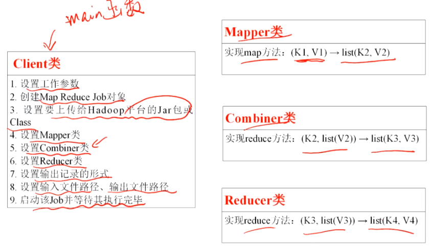
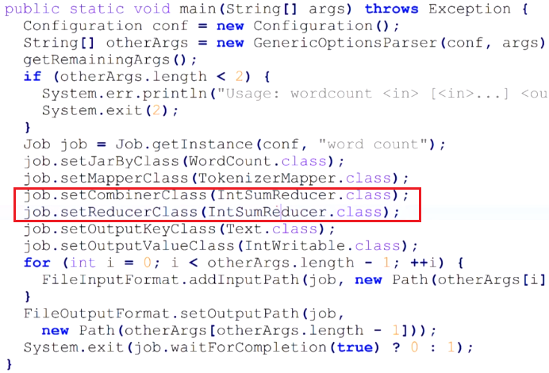

# 分布式系统学习笔记8：MapReduce、分布式计算框架概述

**内容几乎全部来源于  西安电子科技大学 李龙海 老师的分布式系统课程。**

博主只是老师的速记员。

本课程是面向普通本科生的课程，内容非常简略、浅显，适合任何人作为“导论的导论”来阅读。

> MapReduce 是一种分布式高性能计算场景下编程模型，其将面向大数据的计算任务划分为多个子任务并分配给多个子节点进行计算。
>
> 该模型适用于批处理类的操作，在处理大量读少量写的操作效率很高，大量随机读写的操作效率不高。其封装了并行处理、容错处理、本地化计算、负载均衡等细节。对内实现了相当多自动化的处理过程，对外则提供了简单而强大的接口。

MapReduce 将计算任务分为三个阶段：Map、聚集混洗（包含二次分区）、Reduce

如果一轮无法完成计算任务，就将结果进行新的输入，再进行一次 MapReduce。

在 MapReduce 中，所有的输入和输出都是 kv 对。因此非键值对形式的数据如果想用 MapReduce 进行计算就需要先处理成 kv 对的形式。

### 计算阶段

- Map 阶段：第一阶段并行。将输入文件划分为多个分区，每个分区交给一个独立的 Map 子任务进行处理；
- 聚集混洗阶段：各 Map 子任务输出的 <k, v> 数组按 key 聚集，聚集成数组 `A={<k1, [v1, v2, ...]>,<k2, [v3, v4, ...]>}` 的形式；
- Reduce 阶段：第二阶段并行，将聚集后的 A 重新分区，每个分区都交给一个独立的 Reduce 子任务处理。Reduce 子任务根据输入生成一系列 <k, v> 对。

设计 MapReduce 程序的要点：通过 Map 子任务输出的 key 值部分控制不同子任务输出结果的相互交换和聚集

### 示例：单词计数

- 为什么 Map 不直接统计单词个数？
  - 因为每个子任务算出来的都是中间结果，后面还要进行聚合混洗，方便在 Reduce 中进行加和

## 分布式并行计算框架

框架和运行于其上的应用层模块相互协作，共同完成一个完整的分布式计算任务。

框架负责进行数据分片、合并、资源管理、任务调度、容错等任务，开发者只需要关注核心逻辑即可。

Hadoop 中 MapReduce 的资源管理、任务调度通过 Yarn 进行。

实际运行时，resource manager 是主节点，node manager 是从节点。

启动 mapreduce 任务后，主节点会将程序推送给存有数据的 TaskTracker ，紧接着 TaskTracker 会创建一个 MapTask 进程，调用我们写的 map 函数来处理该节点所负责的分片。在任务执行过程中，主节点会不断与 TaskTracker 进行通信以监视运行情况

注意，每次 map 在跑的时候，是连本地要进行处理的数据分片都看不全的，而只能看到当前正在处理的记录

### MapReduce 详细工作过程

1. 框架将输入文件进行分片，默认按HDFS的分片大小分片，如有需要也可定制；

2. 框架针对每一个分片创建一个 MapTask（实际是一个进程，由 NodeManager 创建）：该 MapTask 从文件分片中以记录（Record）的形式逐条读取并将输入记录规整为 <k, v> 形式（读到一个换行符算一条记录，如有需要也可以修改规则。默认行号为 key，内容为 value）。**框架每读入一条记录，就以当前的这一个 <k, v> 对作为参数调用一次 Mapper.map()** ，map 的具体实现由用户定义；

   

3. 每次 map 执行结束后会产生一堆 kv 数组，框架就要将这些中间结果进行二次分区和片内排序，然后准备进行二次分片。（二次分配的逻辑默认是将 key 取 hash 然后对 ReduceTask 节点数取模。该逻辑也可自定义）；

   

4. 框架将片内排序后的元素按 key 值进行**局部聚合（Combine）**（该处逻辑可通过 Combiner 对象定制）。默认将<k1, v1>、<k1, v2>、<k1, v3> 聚合为 <k1, [v1, v2, v3]>；

   

5. 经过排序、聚合后的数据暂存进入 HDFS（将中间数据落盘存储到 HDFS 中，后续需要由完成落盘存储工作的节点通知 Reduce 节点中间数据的存储路径）；

6. 框架针对用户对 ReduceTask 数目的设定创建 n 个 ReduceTask（设定方法：conf.setNumReduceTasks(int n)）再对数据的混洗，开始 Reduce 阶段;

7. Reduce 也是一个新的进程，框架将每个二次分片发给一个 ReduceTask，该任务从二次分片中每取出一条 <k1, [v1, v2, v3]> 形式的记录，就用其作为参数调用一次 Reducer.reduce()，该函数生成最终结果。

   

如果不对 MapReduce 的工作流程进行修改（绝大多数情况下都不会动框架的），那么实际需要开发的代码就只有 Map 和 Reduce 两部分，其他的任务均由框架完成。

### MapReduce 程序构成

### 借助 Combiner 优化计算

可以在 Combine 阶段对上面的计算进行优化。

原本的方案中，保存和传输经过局部聚合后得到的 <aaa, [1, 1, 1, 1]> 需要较大的空间和带宽，因此我们可以在这里多进行一步处理： <aaa, [1, 1, 1, 1]> 改为 <aaa, 4> 后再交给 Reduce 阶段。这一步的操作实际上和我们之前 Reduce 阶段的逻辑是相同的，因此这两部分可以使用相同的代码。

