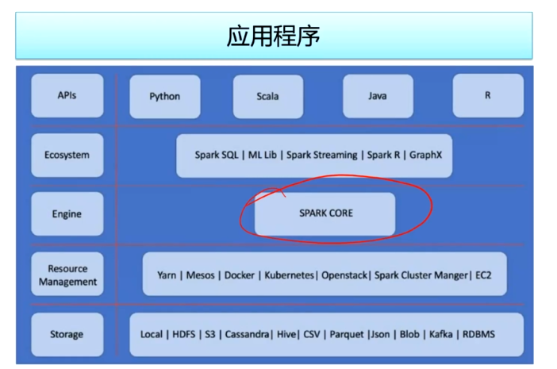
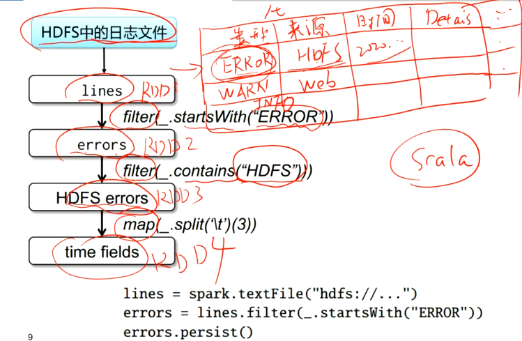
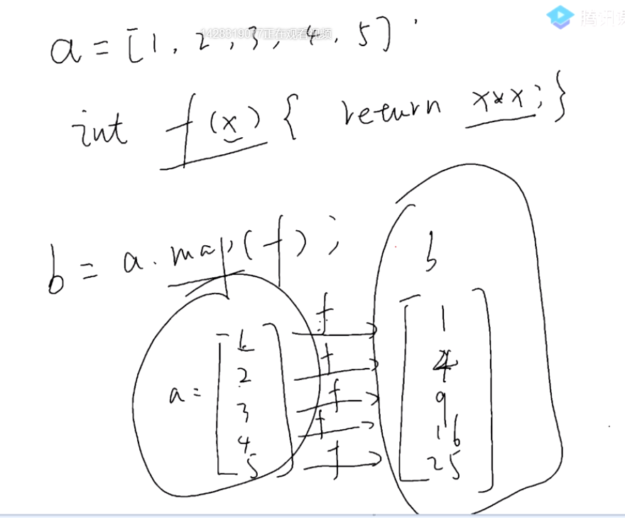
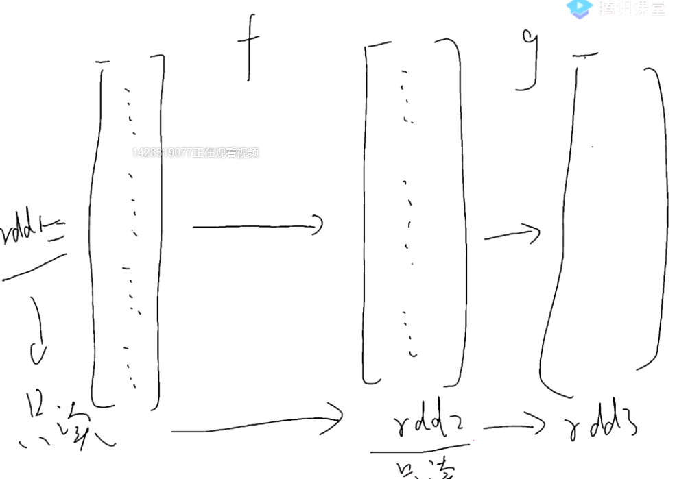
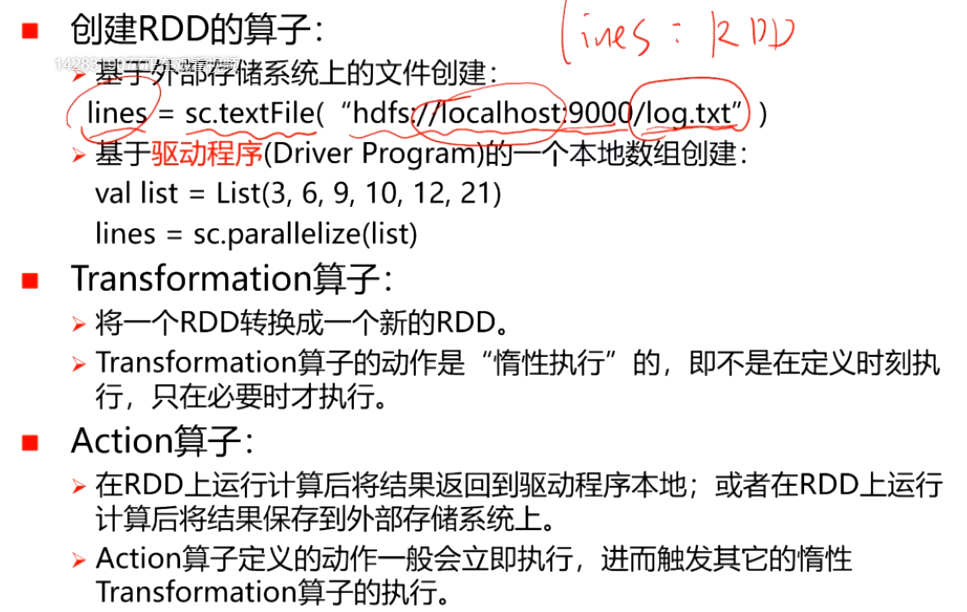

# 分布式系统学习笔记9：Spark 平台和基于 RDD-DAG 的计算模型

## Spark 简介

Spark 是快速、通用、可扩展的分布式计算平台（引擎），有丰富的语言、API、类库、部署模式和数据源的支持，能够进行批处理、流处理和复杂的业务分析。

Spark 相对于 MapReduce 能有百倍的性能提升，原因有二：

- 首先是 MapReduce 将中间结果存储到 HDFS 中，Spark 则选择尽量将结果缓存入内存；
- 其次，Spark 在计算原理上进行了一些改变——让应用层把一个宏观的分布式计算任务抽象为一个 DAG（有向无环图。图中的顶点是数据，弧是对数据进行的操作），然后可以根据该 DAG 来将一些计算子任务进行合并，实现数据流动量的下降

Spark 平台体系结构：

Spark Core 直接对上层提供了丰富的 API，可以很方便地设计计算任务。为方便使用，Spark 又将自身提供的大量算子再次进行封装，做成了可以简单实用的库（比如方便ML 的 ML Lib、支持直接用 SQL 语言查询大数据的 Spark SQL 、能够进行图计算的 GraphX ）。

Spark Core 引擎在运行前会将宏观的计算任务生成为 DAG 并进行优化，优化的结果就是将我们原先的宏观任务切分为可并行的子任务。

对于子任务调度，Spark 也提供了分布式任务调度器 Spark Cluster Manager，同时也支持很多第三方资源调度平台。

我们为客户端主机写的带有 main() 的程序被称为 Driver Program，Driver Program 运行时会获得 SparkContext（ Spark 客户端库，想要获得 Spark 服务都要调用该库）。执行程序时，需要把计算任务较给 SparkContext，我们的计算任务就要靠它来抽象为 DAG ，然后再抽象为若干个子任务并送到 ClusterManager，由其根据各从节点当前的负载情况以及数据分布情况来决定将具体的任务推送给哪些工人节点。（运行 ClusterManager 的是主节点，运行 WorkerNode 的是从节点）

Spark 每次计算只选择总体数据中的一个或多个分片加载进内存进行计算和缓存，规避了内存装不下的问题

## 分布式弹性数据集 RDD

RDD: Resilient Distributed Datasets （弹性分布式数据集），我们可以简单地将其视作一个分布式存储的“大数组”（甚至可以有 TB 那么大）。 

如果在应用时，整个集群的内存都放不下这个大数组，那么就每次只拿出来一部分载入内存进行计算。我们在实际使用时只需关心如何由一个 RDD 通过 Spark 提供的算子转化为另一个 RDD 即可（算子也可以在应用层自定义），而无需关心底层逻辑。Spark 编程，就是定义 RDD 之间的转换过程。

一个分布式计算任务涉及到的不同 RDD 之间存在依赖关系， RDD 的每次转换都会生成一个新的依赖关系，RDD 及其之间的依赖关系就组成了 DAG 。

在Spark 中可以对 RDD 内部元素进行并行的粗粒度操作，具体操作由应用层定义

#### RDD 转换举例：日志过滤

这里面可以将两个 filters 合并

#### Spark 的函数式编程思想：总是产生新数据

进行如下图这样的一次计算，不会影响原有 a 数组的值，而会产生一个新数组 b

在 Spark 中，我们可以认为每个 RDD 都是只读的，所有对 RDD 的操作都会生成一个新的 RDD 而非覆盖原有数据

## 常用的 RDD 算子

## 用 Spark 实现简单的大数据处理任务